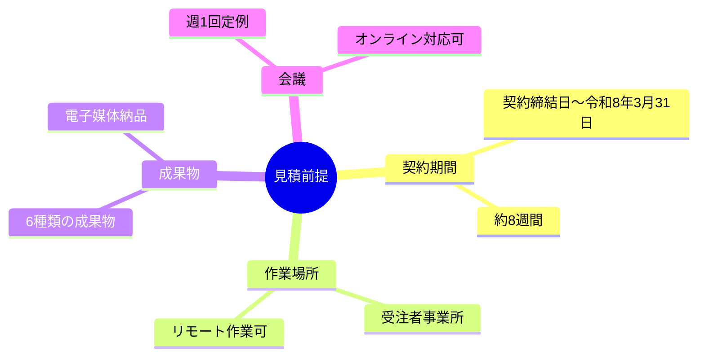
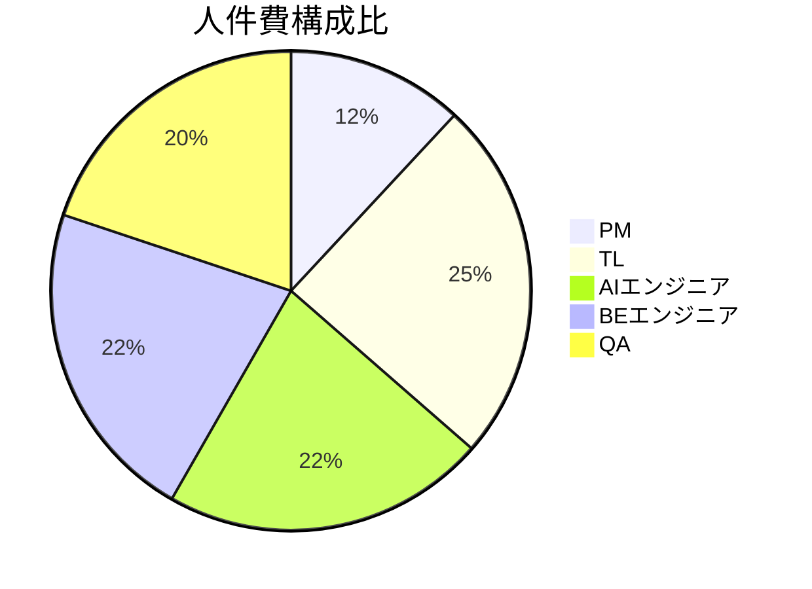
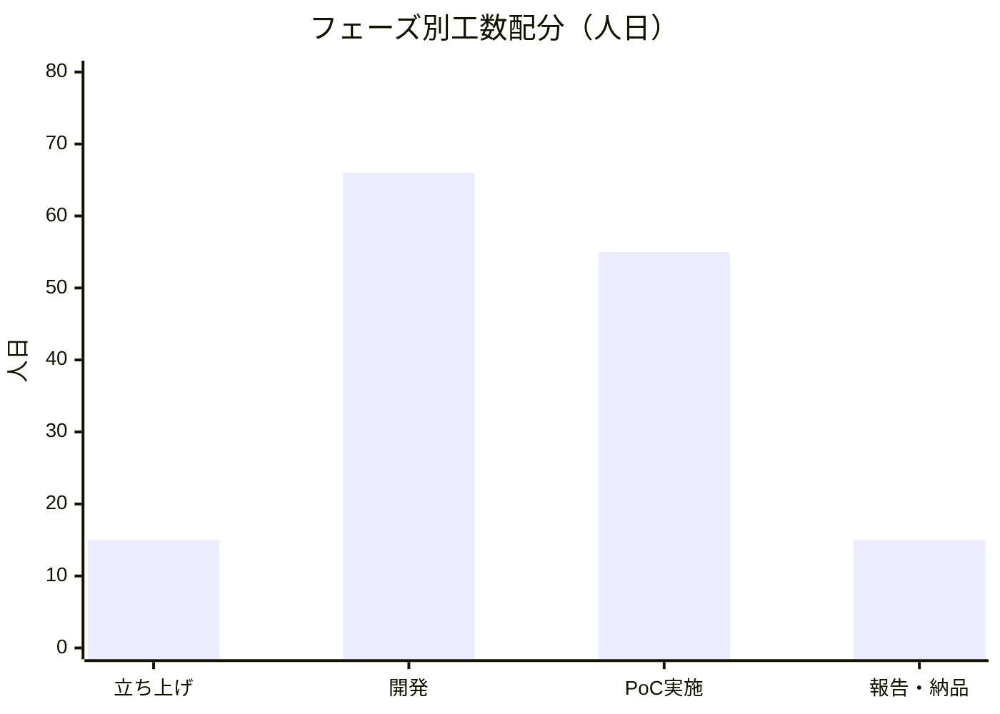
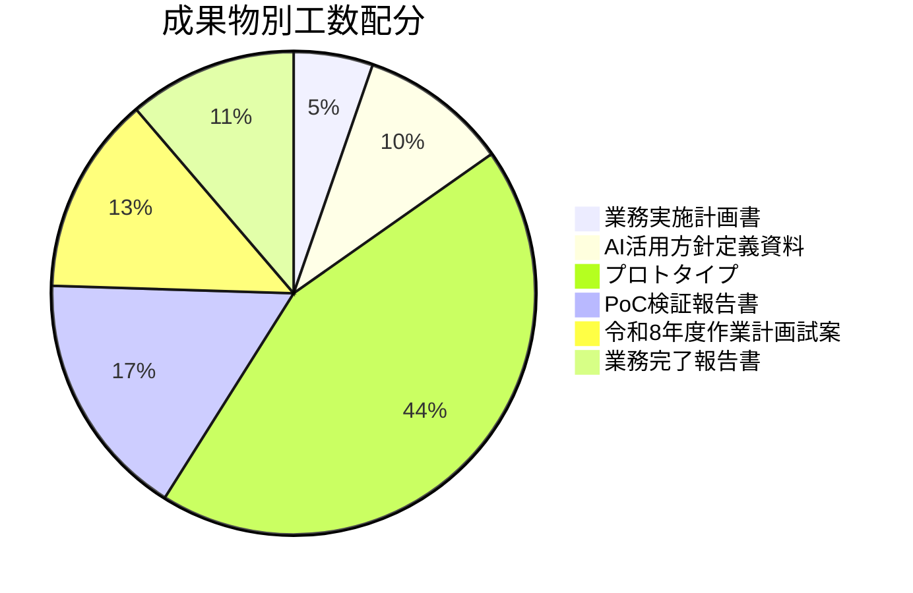
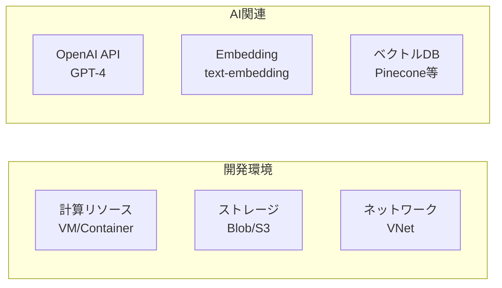
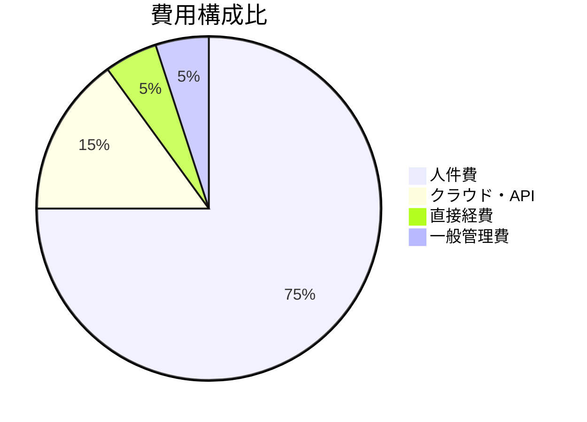
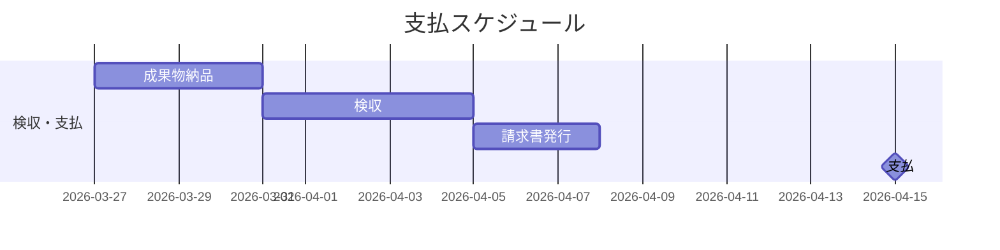
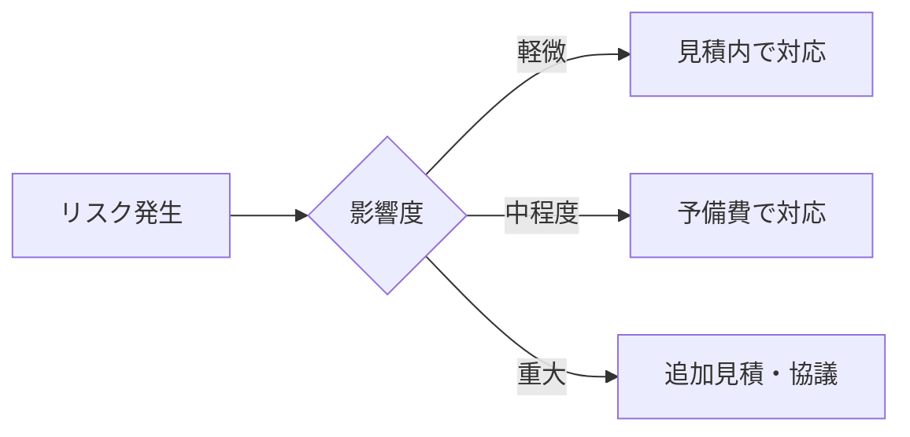

# 費用見積書

## 第三者検証業務におけるドキュメントレビュー支援AIエージェントの設計開発に係る調査研究

---

## 1. 見積概要

### 1.1 見積総額

| 項目 | 金額（税抜） | 消費税 | 金額（税込） |
|------|-------------|--------|-------------|
| 本体価格 | ○○,○○○,○○○円 | ○,○○○,○○○円 | ○○,○○○,○○○円 |

### 1.2 見積前提条件

---

## 2. 費用内訳

### 2.1 人件費

| 役割 | 単価（人日） | 工数（人日） | 小計 |
|------|-------------|-------------|------|
| プロジェクトマネージャー（PM） | ○○,○○○円 | 18 | ○,○○○,○○○円 |
| テクニカルリード（TL） | ○○,○○○円 | 37 | ○,○○○,○○○円 |
| AIエンジニア（AI） | ○○,○○○円 | 33 | ○,○○○,○○○円 |
| バックエンドエンジニア（BE） | ○○,○○○円 | 33 | ○,○○○,○○○円 |
| 品質管理担当（QA） | ○○,○○○円 | 30 | ○,○○○,○○○円 |
| **人件費計** | - | **151** | **○○,○○○,○○○円** |

### 2.2 直接経費

| 項目 | 内容 | 金額 |
|------|------|------|
| クラウド利用費 | 開発・PoC環境（Azure/AWS） | ○○○,○○○円 |
| LLM API利用費 | OpenAI API / Azure OpenAI | ○○○,○○○円 |
| 開発ツール | IDE、CI/CD、コラボレーションツール | ○○○,○○○円 |
| 通信費 | オンライン会議、データ通信 | ○○,○○○円 |
| **直接経費計** | - | **○,○○○,○○○円** |

### 2.3 一般管理費

| 項目 | 算定基準 | 金額 |
|------|---------|------|
| 一般管理費 | 人件費の○○% | ○,○○○,○○○円 |

---

## 3. 工数詳細

### 3.1 フェーズ別工数

| フェーズ | 期間 | PM | TL | AI | BE | QA | 計 |
|---------|------|:--:|:--:|:--:|:--:|:--:|:--:|
| 立ち上げ | Week 1 | 3 | 3 | 3 | 3 | 3 | 15 |
| 開発 | Week 2-4 | 6 | 15 | 15 | 15 | 15 | 66 |
| PoC実施 | Week 5-7 | 6 | 15 | 13 | 13 | 8 | 55 |
| 報告・納品 | Week 8 | 3 | 4 | 2 | 2 | 4 | 15 |
| **合計** | - | **18** | **37** | **33** | **33** | **30** | **151** |

### 3.2 成果物別工数

| 成果物 | 主担当 | 工数（人日） |
|--------|--------|-------------|
| 業務実施計画書 | PM/TL | 8 |
| AI活用方針定義資料 | TL/AI | 15 |
| プロトタイプ一式 | TL/AI/BE | 66 |
| PoC検証報告書 | TL/QA | 25 |
| 令和8年度作業計画試案 | PM/TL | 20 |
| 業務完了報告書 | PM/QA | 17 |
| **合計** | - | **151** |

---

## 4. クラウド・API費用詳細

### 4.1 クラウド利用費

| サービス | 用途 | 月額概算 | 期間 | 小計 |
|---------|------|---------|------|------|
| Azure/AWS VM | 開発・テスト環境 | ○○,○○○円 | 2ヶ月 | ○○,○○○円 |
| ストレージ | ドキュメント・データ保管 | ○,○○○円 | 2ヶ月 | ○○,○○○円 |
| ベクトルDB | RAG用ベクトル格納 | ○○,○○○円 | 2ヶ月 | ○○,○○○円 |
| **クラウド計** | - | - | - | **○○○,○○○円** |

### 4.2 LLM API利用費

| モデル | 用途 | トークン単価 | 想定利用量 | 小計 |
|--------|------|-------------|-----------|------|
| GPT-4o | チェック実行 | $○/1M tokens | ○○M tokens | ○○○,○○○円 |
| GPT-4o-mini | 開発・テスト | $○/1M tokens | ○○M tokens | ○○,○○○円 |
| text-embedding-3-small | Embedding | $○/1M tokens | ○○M tokens | ○○,○○○円 |
| **API利用費計** | - | - | - | **○○○,○○○円** |

※為替レート: $1 = ○○○円で算出

---

## 5. 費用構成

### 5.1 構成比

### 5.2 費用サマリ

| 区分 | 金額（税抜） | 構成比 |
|------|-------------|--------|
| 人件費 | ○○,○○○,○○○円 | 約75% |
| クラウド・API利用費 | ○,○○○,○○○円 | 約15% |
| その他直接経費 | ○○○,○○○円 | 約5% |
| 一般管理費 | ○,○○○,○○○円 | 約5% |
| **合計（税抜）** | **○○,○○○,○○○円** | **100%** |
| 消費税（10%） | ○,○○○,○○○円 | - |
| **合計（税込）** | **○○,○○○,○○○円** | - |

---

## 6. 支払条件

### 6.1 支払スケジュール

| 項目 | 内容 |
|------|------|
| 支払方法 | 一括払い |
| 支払時期 | 検収完了後30日以内 |
| 請求書発行 | 検収完了後 |

---

## 7. 特記事項

### 7.1 見積条件

1. **本見積の有効期限**: 提出日より60日間
2. **為替変動**: API利用費は為替レート変動により増減の可能性あり
3. **追加作業**: 本見積範囲外の追加作業が発生した場合は別途協議
4. **クラウド利用**: ISMAP準拠クラウドサービスを使用

### 7.2 除外事項

以下の項目は本見積に含まれません：

- 本番環境の構築・運用費用
- 令和8年度以降の保守・運用費用
- データ移行費用
- 第三者ライセンス費用（別途発生する場合）
- 出張旅費（対面会議が発生する場合）

### 7.3 リスク対応費

本見積には、軽微なリスク対応のための予備費（人件費の約5%）を含んでいます。
重大なリスクが発生した場合は、別途協議の上、追加見積を提出いたします。

---

## 8. 見積明細書

### 8.1 詳細見積

| No. | 大項目 | 中項目 | 小項目 | 数量 | 単位 | 単価 | 金額 |
|-----|--------|--------|--------|------|------|------|------|
| 1 | 人件費 | PM | プロジェクト管理 | 18 | 人日 | ○○,○○○ | ○,○○○,○○○ |
| 2 | 人件費 | TL | 技術統括 | 37 | 人日 | ○○,○○○ | ○,○○○,○○○ |
| 3 | 人件費 | AI | AI開発 | 33 | 人日 | ○○,○○○ | ○,○○○,○○○ |
| 4 | 人件費 | BE | バックエンド開発 | 33 | 人日 | ○○,○○○ | ○,○○○,○○○ |
| 5 | 人件費 | QA | 品質管理 | 30 | 人日 | ○○,○○○ | ○,○○○,○○○ |
| 6 | 直接経費 | クラウド | Azure/AWS | 2 | 月 | ○○○,○○○ | ○○○,○○○ |
| 7 | 直接経費 | API | LLM API | 1 | 式 | ○○○,○○○ | ○○○,○○○ |
| 8 | 直接経費 | ツール | 開発ツール | 1 | 式 | ○○○,○○○ | ○○○,○○○ |
| 9 | 直接経費 | 通信 | 通信費 | 2 | 月 | ○○,○○○ | ○○,○○○ |
| 10 | 一般管理費 | - | 一般管理費 | 1 | 式 | ○,○○○,○○○ | ○,○○○,○○○ |
| | | | **小計（税抜）** | | | | **○○,○○○,○○○** |
| | | | 消費税（10%） | | | | ○,○○○,○○○ |
| | | | **合計（税込）** | | | | **○○,○○○,○○○** |

---

**以上**
