# 提案書（本編）

## 第三者検証業務におけるドキュメントレビュー支援AIエージェントの設計開発に係る調査研究

**提案日**: 令和7年12月XX日  
**提案者**: 株式会社○○○○

---

## 目次

1. [提案の概要](#1-提案の概要)
2. [業務理解](#2-業務理解)
3. [提案のポイント](#3-提案のポイント)
4. [技術提案概要](#4-技術提案概要)
5. [実施体制](#5-実施体制)
6. [スケジュール](#6-スケジュール)
7. [品質管理](#7-品質管理)
8. [リスク管理](#8-リスク管理)
9. [成果物](#9-成果物)

---

## 1. 提案の概要

### 1.1 本提案の位置づけ

本提案は、デジタル庁が推進する「第三者検証業務におけるドキュメントレビュー支援AIエージェントの設計開発に係る調査研究」に対する技術提案書です。

弊社は、先行PoCの成果を踏まえ、**2ヶ月間の技術検証**により、生成AIを活用したドキュメントレビュー支援の**技術的実現可能性を明らかにする**ことを目的として本業務を遂行いたします。

### 1.2 提案のコンセプト

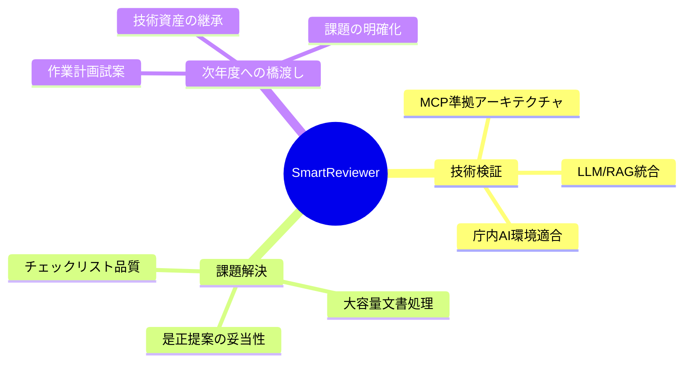

### 1.3 期待される効果

| 効果 | 内容 |
|------|------|
| **技術的実現可能性の明確化** | 具体的な評価指標とともに実現可能性を検証 |
| **課題と対応方針の整理** | 技術面・運用面・セキュリティ面の課題を整理 |
| **年間計画試案の策定** | 令和8年度本格導入に向けた計画を策定 |

---

## 2. 業務理解

### 2.1 調達の背景

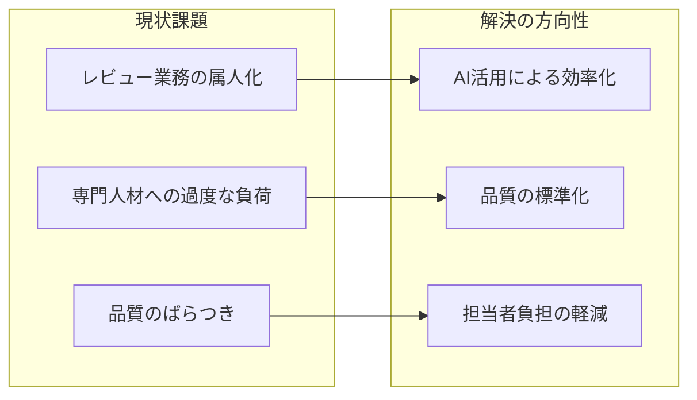

### 2.2 先行PoCで明らかになった課題

| # | 課題 | 概要 | 本提案での対応 |
|---|------|------|---------------|
| 1 | チェックリスト品質 | AI解釈可能な形式への変換 | 構造化チェックリスト設計 |
| 2 | 大容量文書処理 | 数万〜数十万文字の効率的処理 | 文書分割・階層処理方式 |
| 3 | 是正提案の妥当性 | 継続的な評価・改善基盤 | 回帰テスト環境構築 |
| 4 | 庁内AI環境への適合 | 源内の技術的制約への対応 | 制約考慮設計 |

### 2.3 MVPスコープ

本調査研究は2ヶ月間の技術検証であることから、以下の範囲に限定したMVPを開発します。

| 項目 | 範囲 |
|------|------|
| チェック対象文書種別 | 2種類（基本設計書、全体テスト計画書） |
| チェック項目 | 各文書上位10項目程度（計20項目程度） |
| 評価用データセット | 対象文書各10件程度（合計20件程度） |

---

## 3. 提案のポイント

### 3.1 3つの強み

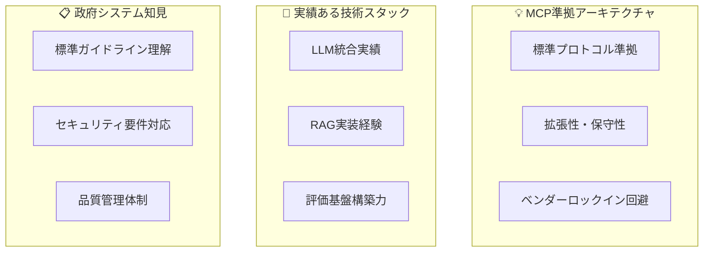

### 3.2 差別化要素

| 要素 | 内容 |
|------|------|
| **再現可能なPoC** | 特定ベンダー依存しない技術選定 |
| **評価基盤の構築** | 回帰テスト環境による継続的品質担保 |
| **段階的拡張設計** | 次年度本格導入を見据えた設計 |

---

## 4. 技術提案概要

### 4.1 システムアーキテクチャ

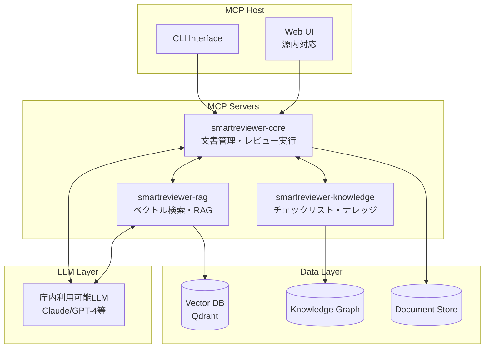

### 4.2 先行PoC課題への対応方針

#### 課題1: チェックリスト品質

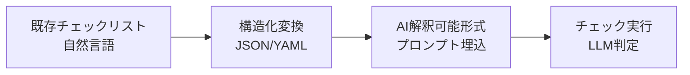

#### 課題2: 大容量文書処理

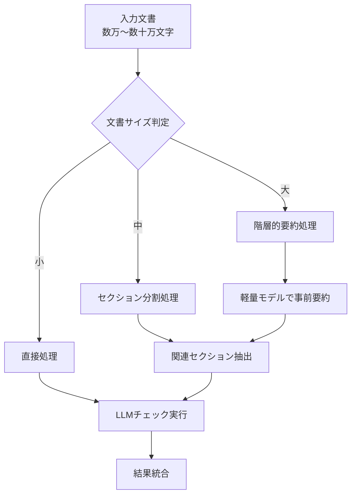

#### 課題3: 是正提案の妥当性評価

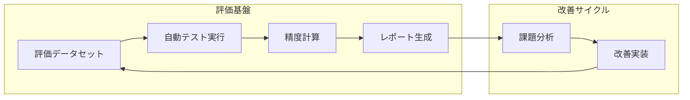

### 4.3 KPI設定

| 指標 | 目標値 | 測定方法 |
|------|--------|---------|
| チェック合致率（Accuracy） | ≥70% | 評価データセットでの測定 |
| 適合率（Precision） | ≥70% | 指摘の正確性 |
| 再現率（Recall） | ≥70% | 指摘の網羅性 |
| 処理時間 | ≤30秒/文書 | 実測 |
| 再現性 | ≥95% | 複数回実行の一致率 |

---

## 5. 実施体制

### 5.1 体制図

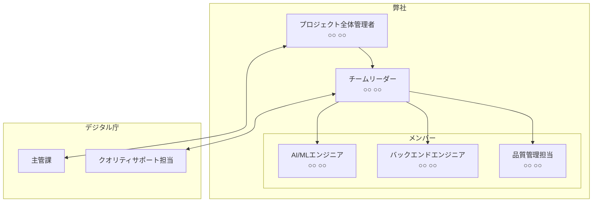

### 5.2 役割分担

| 役割 | 担当者 | 主な責務 |
|------|--------|---------|
| プロジェクト全体管理者 | ○○ ○○ | 全体統括、主管課との調整 |
| チームリーダー | ○○ ○○ | 業務実施の指揮、技術判断 |
| AI/MLエンジニア | ○○ ○○ | LLM統合、プロンプト設計 |
| バックエンドエンジニア | ○○ ○○ | MCP実装、システム構築 |
| 品質管理担当 | ○○ ○○ | テスト、品質管理 |

---

## 6. スケジュール

### 6.1 全体スケジュール

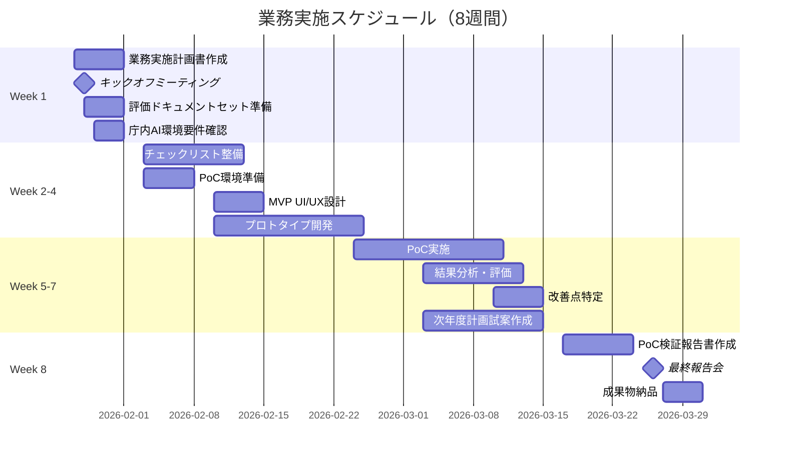

### 6.2 マイルストーン

| # | マイルストーン | 予定日 | 成果物 |
|---|---------------|--------|--------|
| 1 | キックオフ | Week 1 | 業務実施計画書 |
| 2 | AI活用方針定義完了 | Week 2末 | AI活用方針定義資料 |
| 3 | プロトタイプ完成 | Week 4末 | プロトタイプ（動作可能） |
| 4 | PoC完了 | Week 7末 | PoC検証報告書（ドラフト） |
| 5 | 最終報告会 | Week 8 | 全成果物 |

---

## 7. 品質管理

### 7.1 品質管理方針

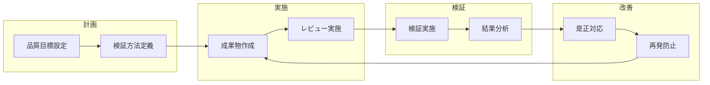

### 7.2 品質目標

| 成果物 | 品質目標 | 検証方法 |
|--------|---------|---------|
| プロトタイプ | チェック合致率70%以上 | 評価データセットでの測定 |
| PoC検証報告書 | 指摘なしでの承認 | 主管課レビュー |
| 令和8年度計画試案 | 実行可能性の確認 | 主管課との協議 |

---

## 8. リスク管理

### 8.1 リスク一覧

| # | リスク | 影響度 | 発生確率 | 対策 |
|---|--------|--------|----------|------|
| 1 | LLM精度が目標未達 | 高 | 中 | 複数LLM比較、プロンプトチューニング |
| 2 | 大容量文書処理の性能問題 | 中 | 中 | 段階的処理、キャッシュ活用 |
| 3 | 庁内AI環境の制約判明 | 高 | 低 | 早期の要件確認、代替案の準備 |
| 4 | 評価データセット不足 | 中 | 低 | 合成データ生成、段階的拡充 |

### 8.2 リスク対応フロー

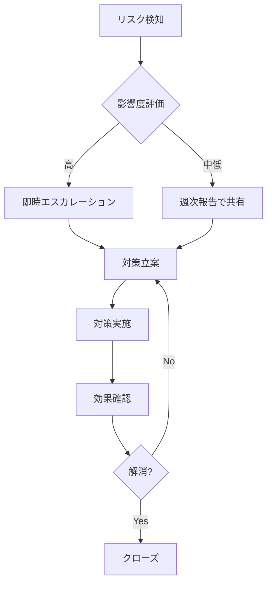

---

## 9. 成果物

### 9.1 成果物一覧

| # | 成果物名 | 納品期限 | 形式 |
|---|---------|---------|------|
| 1 | 業務実施計画書 | 契約締結後1週間以内 | Word/PDF |
| 2 | AI活用方針定義資料 | PoC実施前 | Word/PDF |
| 3 | プロトタイプのソースコード等 | PoC完了時 | Git/ZIP |
| 4 | PoC検証報告書 | PoC完了時 | Word/PDF |
| 5 | 令和8年度作業計画試案 | 契約満了前 | Word/PDF |
| 6 | 業務完了報告書 | 契約満了前 | Word/PDF |

### 9.2 納品方法

- 全て日本語で作成
- Microsoft Office形式での納品（編集可能）
- ソースコードはGitリポジトリまたはZIPで納品
- 不正プログラム対策ソフトウェアによる確認実施

---

## 付録

- 技術提案書: [proposal_technical.md](proposal_technical.md)
- 実施スケジュール詳細: [proposal_schedule.md](proposal_schedule.md)
- 実施体制詳細: [proposal_team.md](proposal_team.md)
- 費用見積書: [proposal_cost.md](proposal_cost.md)
- 品質管理計画: [proposal_quality.md](proposal_quality.md)

---

**以上**
