# 品質管理計画

## 第三者検証業務におけるドキュメントレビュー支援AIエージェントの設計開発に係る調査研究

---

## 1. 品質管理方針

### 1.1 品質目標

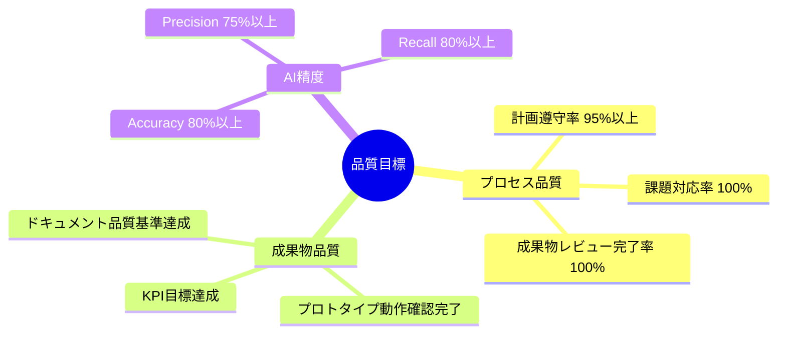

### 1.2 品質管理体制

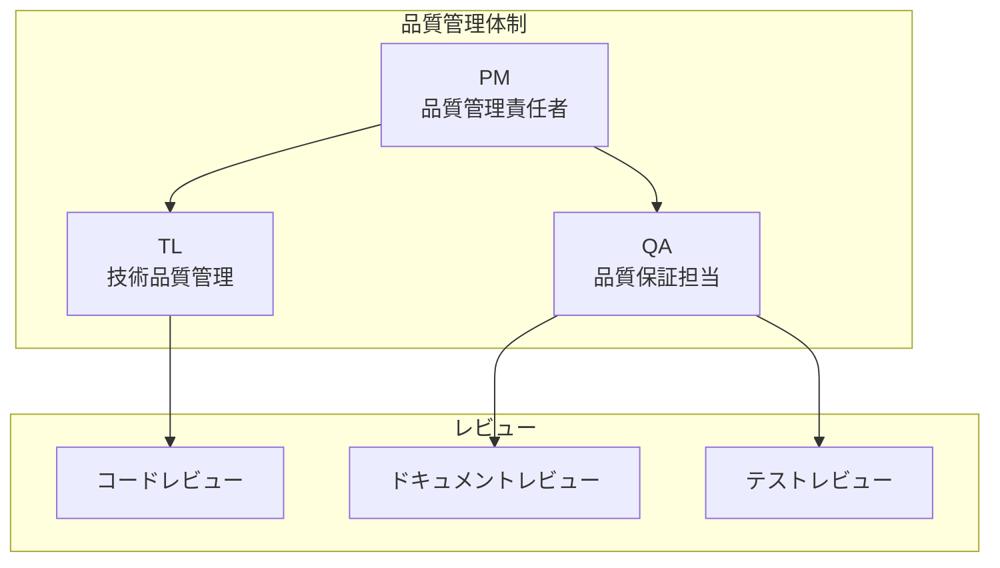

---

## 2. 品質管理プロセス

### 2.1 品質管理サイクル

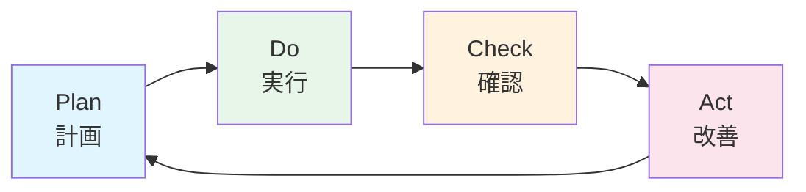

### 2.2 各フェーズの品質活動

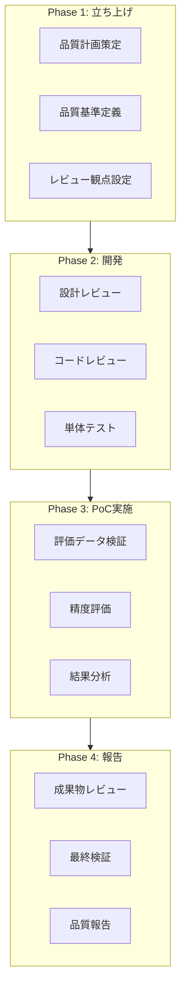

---

## 3. 成果物品質基準

### 3.1 ドキュメント品質基準

| 品質特性 | 基準 | 確認方法 |
|---------|------|---------|
| 完全性 | 仕様書要求項目の100%網羅 | チェックリスト |
| 正確性 | 技術的誤りがないこと | 専門家レビュー |
| 一貫性 | 用語・表記の統一 | 用語集との照合 |
| 可読性 | 構造化・図表の適切な使用 | レビュー |
| 追跡性 | 要件との対応付け | トレーサビリティマトリクス |

### 3.2 成果物別品質チェックリスト

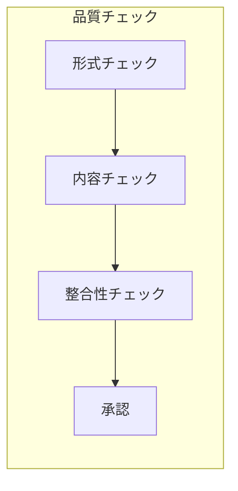

#### 業務実施計画書

| # | チェック項目 | 確認者 |
|---|-------------|--------|
| 1 | 業務の目的・範囲が明確か | QA |
| 2 | スケジュールが現実的か | PM |
| 3 | 体制・役割分担が明確か | PM |
| 4 | リスク対策が記載されているか | PM |
| 5 | 成果物一覧が正確か | QA |

#### AI活用方針定義資料

| # | チェック項目 | 確認者 |
|---|-------------|--------|
| 1 | 使用するLLM/モデルが明記されているか | TL |
| 2 | プロンプト設計方針が記載されているか | AI |
| 3 | 評価指標・目標値が定義されているか | TL |
| 4 | リスク・制約事項が記載されているか | PM |
| 5 | 庁内AI環境への適合方針が明確か | TL |

#### プロトタイプ

| # | チェック項目 | 確認者 |
|---|-------------|--------|
| 1 | 全チェック項目が実装されているか | TL |
| 2 | 動作確認が完了しているか | QA |
| 3 | エラーハンドリングが適切か | BE |
| 4 | ログ・監査証跡が出力されるか | BE |
| 5 | セキュリティ要件を満たしているか | TL |

#### PoC検証報告書

| # | チェック項目 | 確認者 |
|---|-------------|--------|
| 1 | 評価方法が明確に記載されているか | QA |
| 2 | 結果データが正確か | QA |
| 3 | 分析・考察が妥当か | TL |
| 4 | 課題・改善点が具体的か | TL |
| 5 | 次年度への示唆が記載されているか | PM |

---

## 4. AI精度評価

### 4.1 評価指標

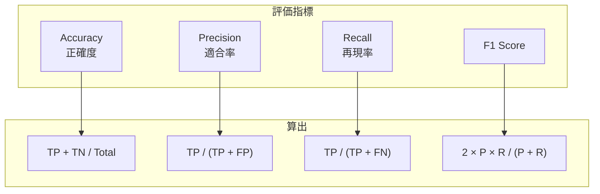

### 4.2 評価目標値

| 指標 | 目標値 | 判定基準 |
|------|--------|---------|
| Accuracy | 80%以上 | 全チェック項目の平均 |
| Precision | 75%以上 | 全チェック項目の平均 |
| Recall | 80%以上 | 全チェック項目の平均 |
| F1 Score | 77%以上 | 全チェック項目の平均 |

### 4.3 評価プロセス

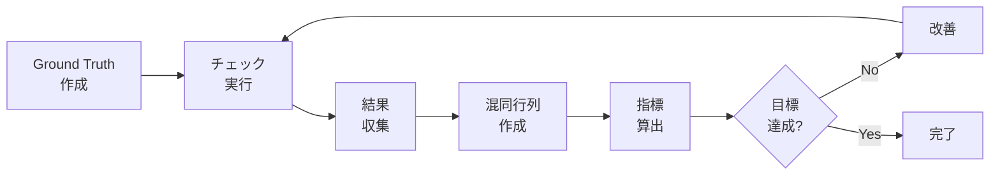

### 4.4 混同行列テンプレート

| | AIが「指摘あり」 | AIが「指摘なし」 |
|---|:---:|:---:|
| **実際に問題あり** | True Positive (TP) | False Negative (FN) |
| **実際に問題なし** | False Positive (FP) | True Negative (TN) |

---

## 5. レビュープロセス

### 5.1 レビュー種別

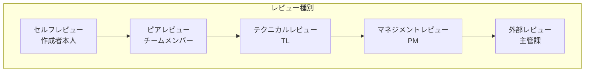

### 5.2 レビュー観点

| レビュー種別 | 観点 | 実施者 |
|-------------|------|--------|
| セルフレビュー | 誤字脱字、形式、論理的整合性 | 作成者 |
| ピアレビュー | 技術的正確性、可読性 | チームメンバー |
| テクニカルレビュー | 技術選定妥当性、実現可能性 | TL |
| マネジメントレビュー | 要件充足、スケジュール整合性 | PM |
| 外部レビュー | 業務要件への適合性 | 主管課 |

### 5.3 レビュー記録

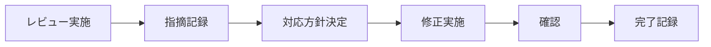

| 項目 | 内容 |
|------|------|
| レビュー日時 | YYYY/MM/DD HH:MM |
| レビュー対象 | ドキュメント名/バージョン |
| レビュアー | 氏名 |
| 指摘事項 | 内容、重要度（High/Medium/Low） |
| 対応方針 | 修正/保留/却下 |
| 対応結果 | 修正内容、確認者 |

---

## 6. テスト計画

### 6.1 テスト種別

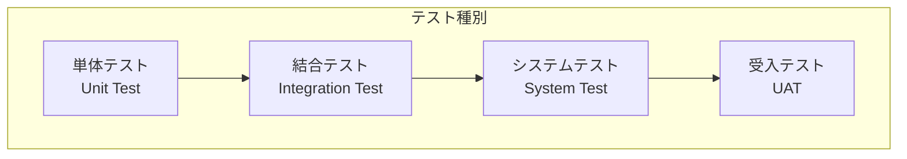

### 6.2 テスト計画

| テスト種別 | 目的 | 担当 | 時期 |
|-----------|------|------|------|
| 単体テスト | 各モジュールの動作確認 | AI/BE | Week 3-4 |
| 結合テスト | モジュール間連携確認 | TL | Week 4 |
| システムテスト | 全体動作・性能確認 | QA | Week 5 |
| 受入テスト | 要件充足確認 | 主管課 | Week 8 |

### 6.3 テストケース設計

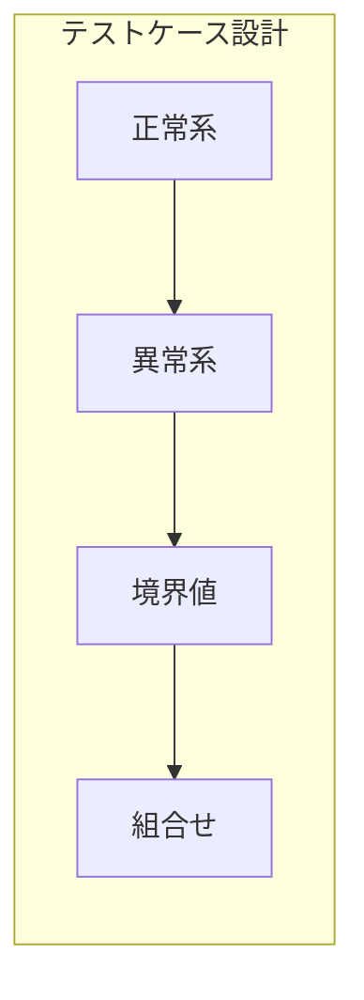

| 観点 | 内容 |
|------|------|
| 正常系 | 想定通りの入力で正しく動作するか |
| 異常系 | 不正入力時に適切にエラーハンドリングするか |
| 境界値 | 大容量ドキュメント等の境界条件で動作するか |
| 組合せ | 複数チェック項目の組合せで正しく動作するか |

---

## 7. 課題管理

### 7.1 課題管理プロセス

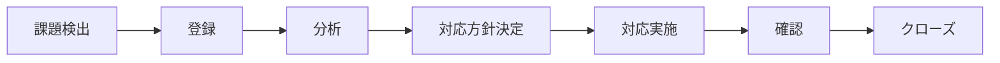

### 7.2 課題重要度分類

| 重要度 | 定義 | 対応期限 |
|--------|------|---------|
| Critical | プロジェクト継続に影響 | 即日対応 |
| High | スケジュール・品質に影響 | 3日以内 |
| Medium | 改善が望ましい | 1週間以内 |
| Low | 軽微な改善 | 次フェーズで対応 |

### 7.3 課題管理表テンプレート

| ID | 登録日 | タイトル | 内容 | 重要度 | 担当 | 期限 | ステータス |
|----|--------|---------|------|--------|------|------|-----------|
| ISS-001 | YYYY/MM/DD | 課題タイトル | 詳細内容 | High | TL | YYYY/MM/DD | Open |

---

## 8. リスク管理

### 8.1 リスク管理プロセス

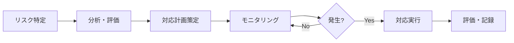

### 8.2 リスク評価マトリクス

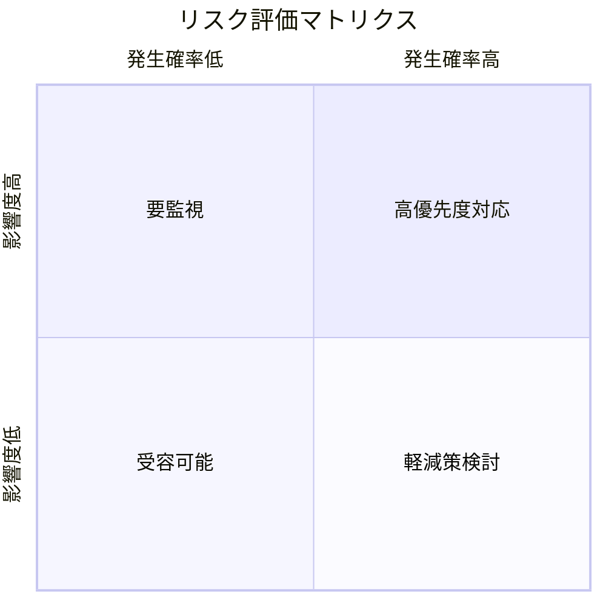

### 8.3 主要リスクと対策

| # | リスク | 発生確率 | 影響度 | 対策 |
|---|--------|:--------:|:------:|------|
| R1 | AI精度が目標未達 | 中 | 高 | 反復改善、チェック項目の絞り込み |
| R2 | スケジュール遅延 | 中 | 高 | バッファ確保、優先度付けタスク管理 |
| R3 | 要員の離脱 | 低 | 中 | ナレッジ共有、バックアップ体制 |
| R4 | 要件変更 | 中 | 中 | 変更管理プロセス、影響分析 |
| R5 | 技術的課題 | 中 | 中 | PoC段階での早期検証、代替案準備 |
| R6 | API利用コスト超過 | 低 | 低 | モニタリング、上限設定 |

### 8.4 リスク対応種別

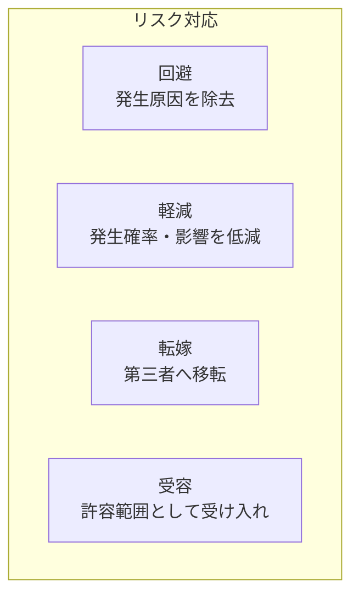

---

## 9. 品質報告

### 9.1 報告頻度

| 報告種別 | 頻度 | 報告先 | 内容 |
|---------|------|--------|------|
| 品質日報 | 日次 | TL | テスト結果、課題 |
| 品質週報 | 週次 | PM, 主管課 | 品質指標、課題状況 |
| 品質月報 | フェーズ終了時 | PM, 主管課 | 品質総括、改善状況 |

### 9.2 品質ダッシュボード

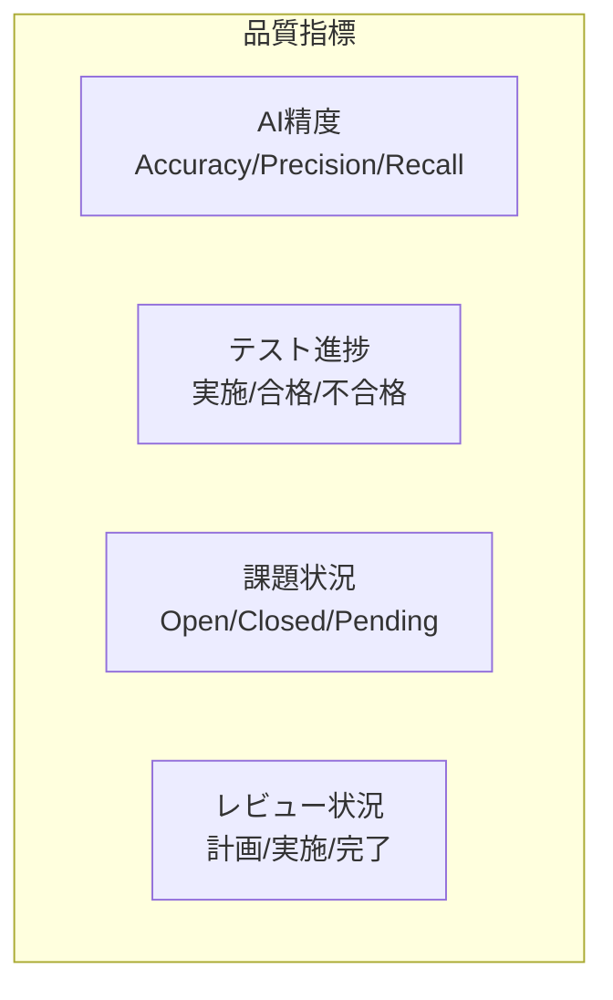

---

## 10. 継続的改善

### 10.1 改善サイクル

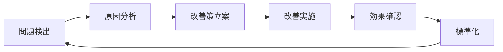

### 10.2 振り返り（レトロスペクティブ）

| 時期 | 内容 |
|------|------|
| フェーズ終了時 | 各フェーズの振り返り、改善点抽出 |
| プロジェクト終了時 | 全体振り返り、次プロジェクトへの教訓 |

---

**以上**
