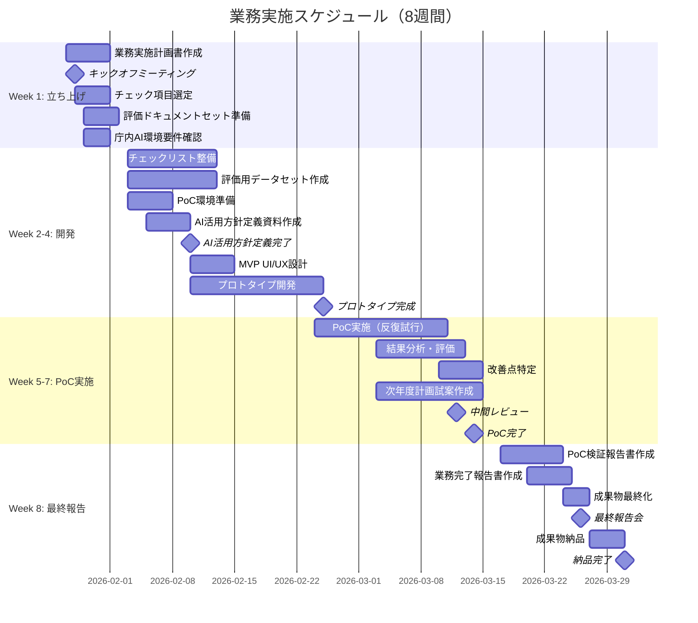
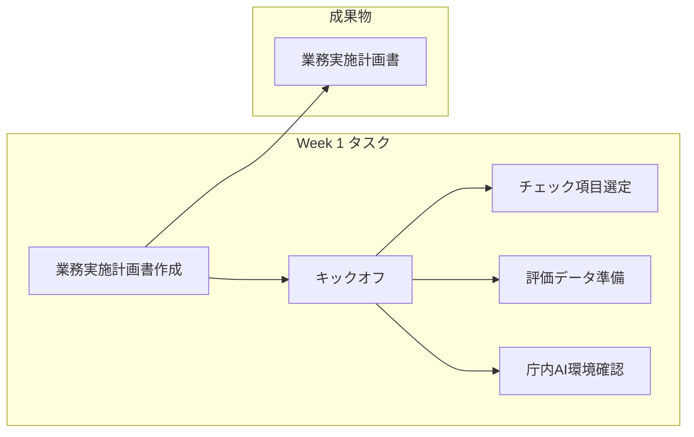
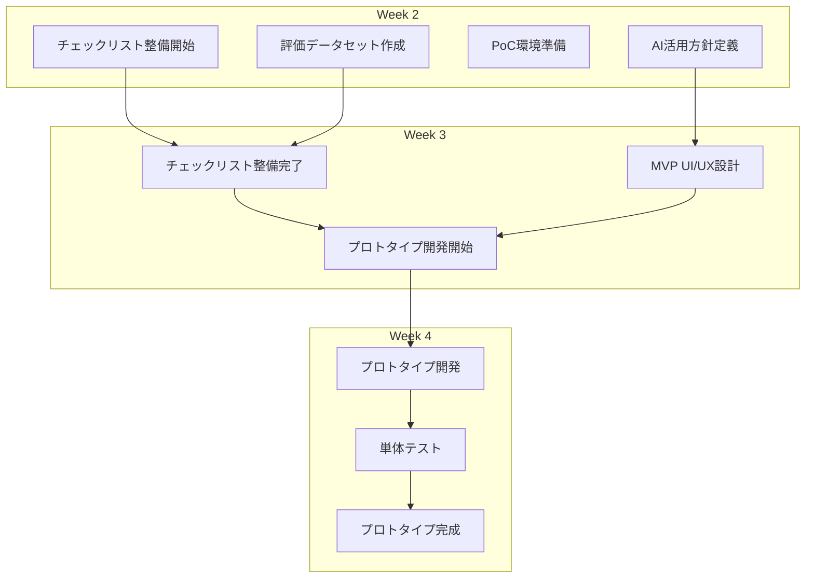
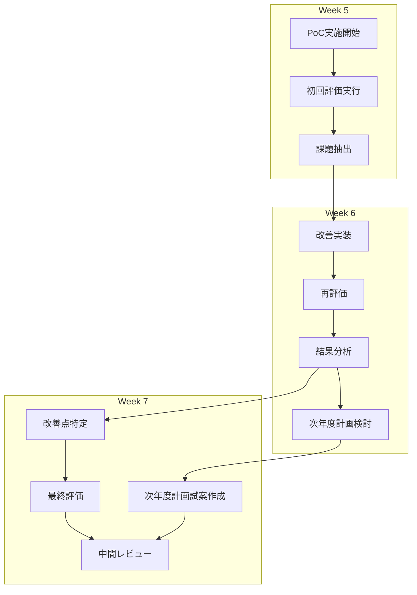
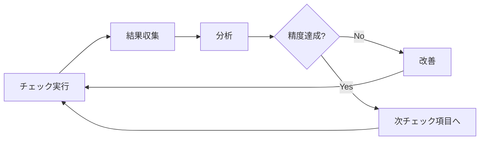
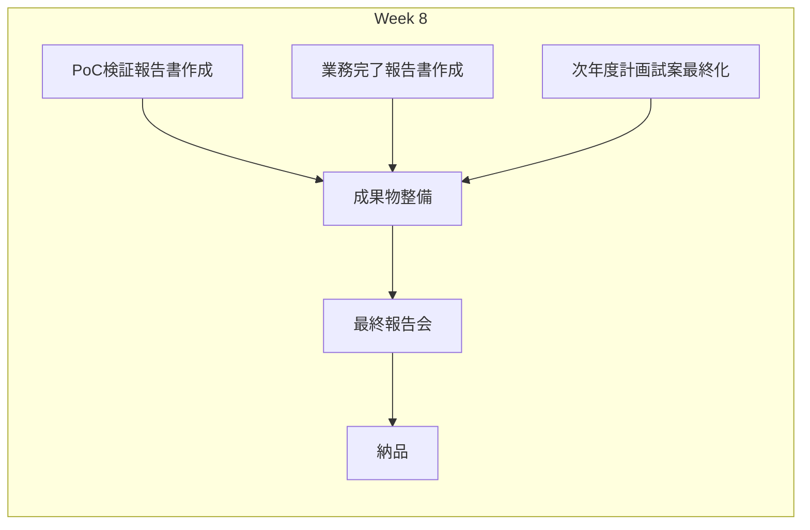
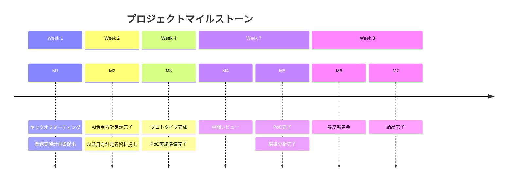
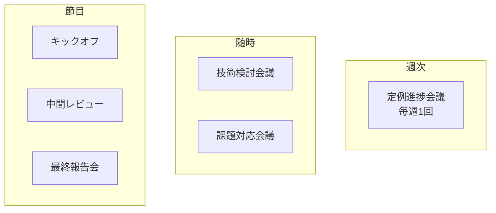
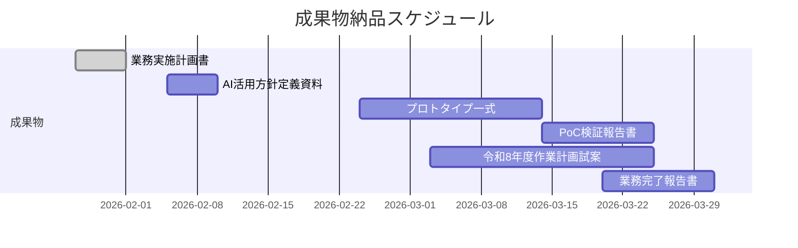

# 実施スケジュール

## 第三者検証業務におけるドキュメントレビュー支援AIエージェントの設計開発に係る調査研究

---

## 1. 全体スケジュール

### 1.1 8週間マスタースケジュール

---

## 2. 週次詳細スケジュール

### 2.1 Week 1: プロジェクト立ち上げ

| 日程 | タスク | 担当 | 成果物 |
|------|--------|------|--------|
| Day 1-2 | 業務実施計画書作成 | PM/TL | 業務実施計画書（ドラフト） |
| Day 2 | キックオフミーティング | 全員 | 議事録 |
| Day 2-5 | レビュー対象文書・チェック項目選定 | TL/QA | チェック項目リスト |
| Day 3-5 | 評価ドキュメントセット準備 | BE/QA | 評価データセット（初版） |
| Day 3-5 | 庁内AI環境要件確認 | TL/AI | 環境要件書 |
| Day 5 | 業務実施計画書提出 | PM | 業務実施計画書（確定） |

### 2.2 Week 2-4: プロトタイプ開発・PoC準備

**Week 2 詳細:**

| 日程 | タスク | 担当 | 成果物 |
|------|--------|------|--------|
| Day 1-5 | チェックリスト構造化 | TL/AI | 構造化チェックリスト |
| Day 1-5 | 評価用データセット作成 | QA | Ground Truth付きデータ |
| Day 1-3 | PoC環境構築 | BE | 動作環境 |
| Day 3-5 | AI活用方針定義資料作成 | TL/AI | AI活用方針定義資料 |

**Week 3 詳細:**

| 日程 | タスク | 担当 | 成果物 |
|------|--------|------|--------|
| Day 1-3 | チェックリスト整備完了 | TL/AI | チェックリスト（確定） |
| Day 1-3 | MVP UI/UX設計 | TL/BE | UI設計書 |
| Day 3-5 | MCPサーバー実装 | BE | smartreviewer-core |
| Day 3-5 | RAGモジュール実装 | AI | smartreviewer-rag |

**Week 4 詳細:**

| 日程 | タスク | 担当 | 成果物 |
|------|--------|------|--------|
| Day 1-3 | チェックロジック実装 | AI/BE | チェック実行エンジン |
| Day 1-3 | 評価システム実装 | QA | 評価基盤 |
| Day 3-5 | 統合・単体テスト | 全員 | テスト結果 |
| Day 5 | プロトタイプ完成 | TL | プロトタイプ（動作可能） |

### 2.3 Week 5-7: PoC実施

**PoC実施サイクル:**

| 週 | タスク | 担当 | 成果物 |
|---|--------|------|--------|
| Week 5 | PoC実施（基本設計書） | 全員 | 評価結果（基本設計書） |
| Week 5-6 | PoC実施（テスト計画書） | 全員 | 評価結果（テスト計画書） |
| Week 6 | 改善実装・再評価 | AI/BE | 改善版プロトタイプ |
| Week 6-7 | 結果分析 | TL/QA | 分析レポート |
| Week 7 | 次年度計画試案作成 | PM/TL | 次年度計画試案（初稿） |
| Week 7 | 中間レビュー | 全員 | 中間レビュー議事録 |

### 2.4 Week 8: 最終報告・成果物作成

| 日程 | タスク | 担当 | 成果物 |
|------|--------|------|--------|
| Day 1-3 | PoC検証報告書作成 | TL/QA | PoC検証報告書 |
| Day 2-4 | 業務完了報告書作成 | PM | 業務完了報告書 |
| Day 1-3 | 次年度計画試案最終化 | PM/TL | 次年度計画試案 |
| Day 4-5 | 成果物最終化・レビュー | 全員 | 成果物一式 |
| Day 5 | 最終報告会 | 全員 | 最終報告会資料 |
| Day 5-8 | 納品作業 | PM | 納品完了 |

---

## 3. マイルストーン

| # | マイルストーン | 予定日 | 判定基準 |
|---|---------------|--------|---------|
| M1 | キックオフ完了 | Week 1 Day 2 | 業務実施計画書承認 |
| M2 | AI活用方針定義完了 | Week 2 Day 5 | AI活用方針定義資料承認 |
| M3 | プロトタイプ完成 | Week 4 Day 5 | 全チェック項目の動作確認 |
| M4 | 中間レビュー | Week 7 Day 3 | 主管課による進捗確認 |
| M5 | PoC完了 | Week 7 Day 5 | KPI達成状況確認 |
| M6 | 最終報告会 | Week 8 Day 5 | 報告会実施完了 |
| M7 | 納品完了 | Week 8 Day 8 | 全成果物の検収完了 |

---

## 4. 定例会議

### 4.1 会議体系

| 会議 | 頻度 | 参加者 | 目的 |
|------|------|--------|------|
| 定例進捗会議 | 週1回 | PM, TL, 主管課 | 進捗報告、課題共有 |
| 技術検討会議 | 随時 | TL, AI, BE | 技術的課題の検討 |
| 課題対応会議 | 随時 | PM, TL, 主管課 | 重要課題のエスカレーション |
| キックオフ | 1回 | 全員 | プロジェクト開始 |
| 中間レビュー | 1回 | 全員 | PoC結果の中間確認 |
| 最終報告会 | 1回 | 全員 | 最終成果の報告 |

---

## 5. 成果物納品スケジュール

| # | 成果物 | 作成開始 | 納品期限 |
|---|--------|---------|---------|
| 1 | 業務実施計画書 | Week 1 Day 1 | 契約締結後1週間以内 |
| 2 | AI活用方針定義資料 | Week 2 Day 3 | PoC実施前（Week 2末） |
| 3 | プロトタイプ一式 | Week 2 Day 5 | PoC完了時（Week 7末） |
| 4 | PoC検証報告書 | Week 7 Day 1 | PoC完了時（Week 8 Day 5） |
| 5 | 令和8年度作業計画試案 | Week 6 Day 1 | 契約満了前（Week 8 Day 5） |
| 6 | 業務完了報告書 | Week 8 Day 1 | 契約満了前（Week 8 Day 8） |

---

**以上**
