# 実施体制

## 第三者検証業務におけるドキュメントレビュー支援AIエージェントの設計開発に係る調査研究

---

## 1. 体制概要

### 1.1 全体体制図

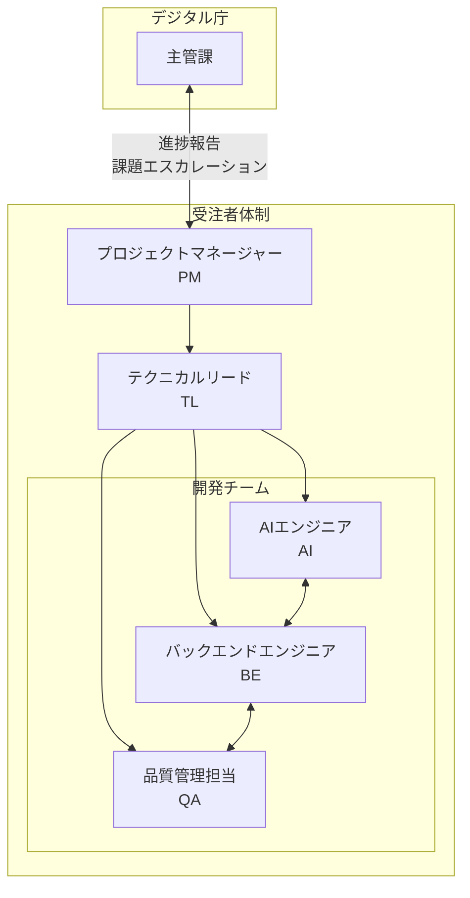

### 1.2 体制構成

| 役割 | 人数 | 担当者 | 参画期間 |
|------|------|--------|----------|
| プロジェクトマネージャー（PM） | 1名 | ○○ ○○ | 全期間（8週間） |
| テクニカルリード（TL） | 1名 | ○○ ○○ | 全期間（8週間） |
| AIエンジニア（AI） | 1名 | ○○ ○○ | Week 2-7（6週間） |
| バックエンドエンジニア（BE） | 1名 | ○○ ○○ | Week 2-7（6週間） |
| 品質管理担当（QA） | 1名 | ○○ ○○ | Week 3-8（6週間） |

---

## 2. 役割と責任

### 2.1 RACI マトリクス

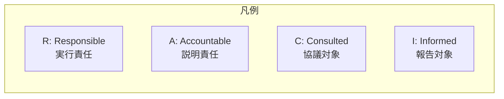

| タスク | PM | TL | AI | BE | QA | 主管課 |
|--------|:--:|:--:|:--:|:--:|:--:|:------:|
| プロジェクト管理 | A/R | C | I | I | I | I |
| 業務実施計画書作成 | A | R | C | C | C | I |
| AI活用方針定義 | A | R | R | C | I | I |
| チェックリスト整備 | A | R | R | I | C | C |
| プロトタイプ開発 | A | R | R | R | C | I |
| PoC実施 | A | R | R | R | R | I |
| 評価・分析 | A | R | R | C | R | I |
| 報告書作成 | A | R | C | C | R | I |
| 成果物レビュー | I | R | C | C | R | A |
| 進捗報告 | R | C | I | I | I | A |

### 2.2 各役割の詳細

#### プロジェクトマネージャー（PM）

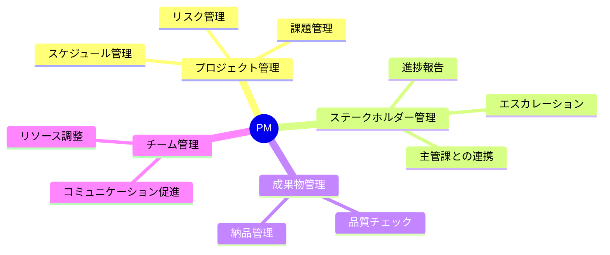

**主な責務:**
- プロジェクト全体の計画・進捗・品質・コスト管理
- 主管課（デジタル庁）との窓口業務
- 週次進捗報告、課題のエスカレーション
- 成果物の最終承認と納品管理
- リスク管理とコンティンジェンシー対応

**必要スキル:**
- プロジェクトマネジメント経験（5年以上）
- 官公庁向けプロジェクト経験
- AI/ML プロジェクト経験

#### テクニカルリード（TL）

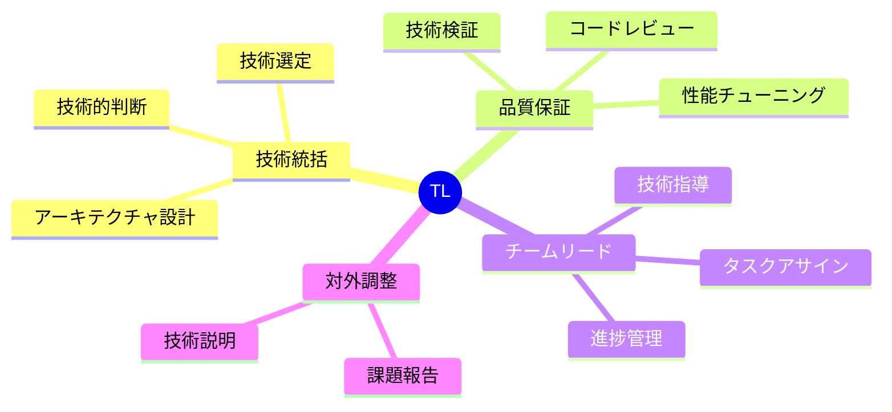

**主な責務:**
- 技術アーキテクチャの設計・レビュー
- AI活用方針の策定と技術選定
- チェックリストの構造化設計
- 技術的課題の解決と意思決定
- チームメンバーへの技術指導

**必要スキル:**
- システム設計経験（5年以上）
- LLM/RAG 実装経験
- MCP（Model Context Protocol）理解
- Python, TypeScript 開発経験

#### AIエンジニア（AI）

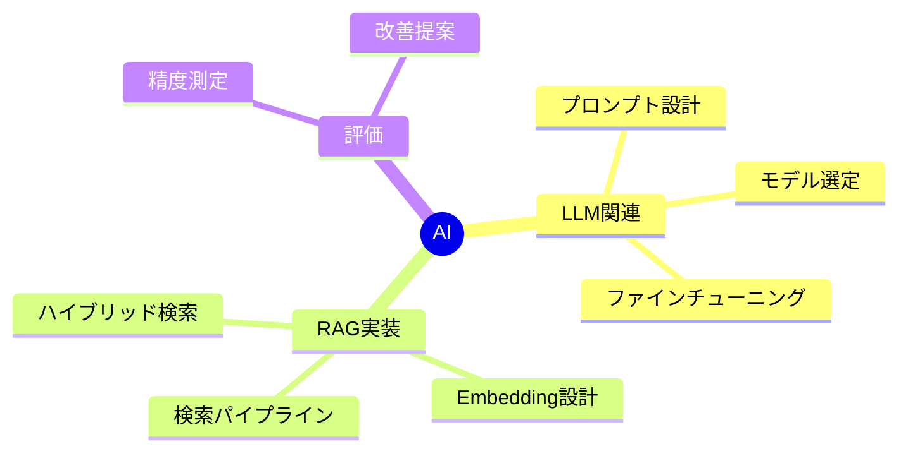

**主な責務:**
- LLM を活用したチェックロジックの実装
- RAG（Retrieval-Augmented Generation）システムの構築
- プロンプトエンジニアリング
- チェック精度の評価・改善

**必要スキル:**
- LLM アプリケーション開発経験（2年以上）
- OpenAI API / Azure OpenAI 利用経験
- RAG システム構築経験
- 自然言語処理の知識

#### バックエンドエンジニア（BE）

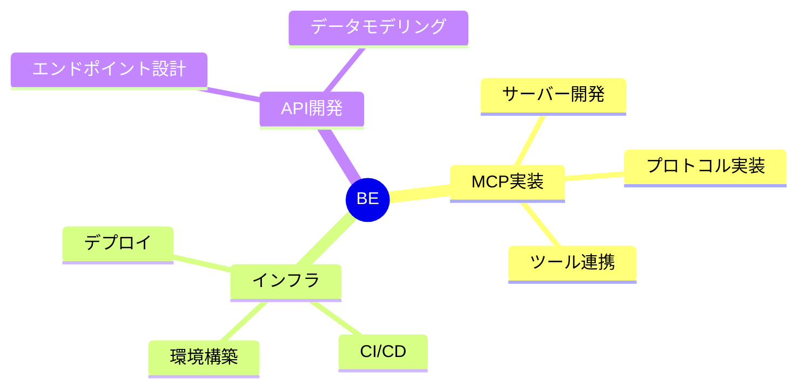

**主な責務:**
- MCP サーバーの設計・実装
- バックエンド API の開発
- クラウド環境の構築・運用
- CI/CD パイプラインの構築

**必要スキル:**
- バックエンド開発経験（3年以上）
- Python, TypeScript 開発経験
- クラウドサービス利用経験（AWS/Azure/GCP）
- コンテナ技術（Docker）

#### 品質管理担当（QA）

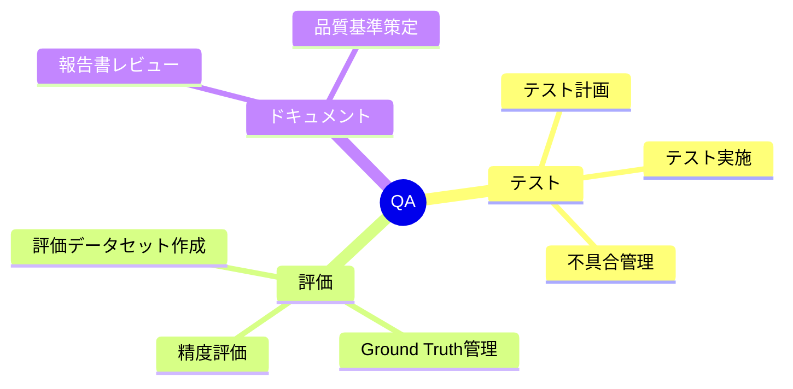

**主な責務:**
- 評価用データセットの作成・管理
- Ground Truth（正解データ）の定義
- PoC 実施時の評価実行
- 評価結果の分析・レポーティング
- 成果物のドキュメントレビュー

**必要スキル:**
- ソフトウェアテスト経験（3年以上）
- ドキュメントレビュー経験
- データ分析スキル
- 品質管理プロセスの知識

---

## 3. コミュニケーション体制

### 3.1 コミュニケーションフロー

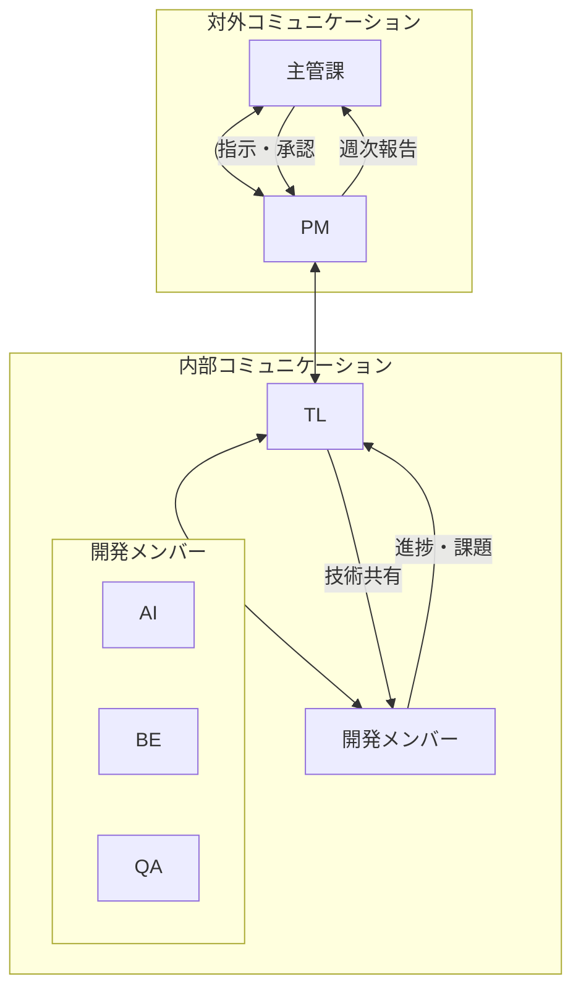

### 3.2 連絡体制

| 種別 | 頻度 | ツール | 参加者 |
|------|------|--------|--------|
| 日次スタンドアップ | 毎日 | オンライン会議 | 開発チーム |
| 週次進捗報告 | 週1回 | 対面/オンライン | PM, TL, 主管課 |
| 技術検討会 | 随時 | オンライン会議 | TL, AI, BE |
| 課題エスカレーション | 随時 | メール/電話 | PM, 主管課 |
| 緊急連絡 | 随時 | 電話 | PM, 主管課 |

### 3.3 報告体系

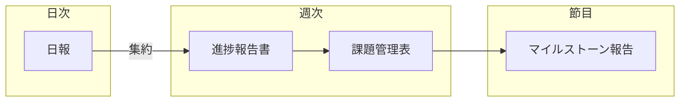

---

## 4. 要員スキルマトリクス

### 4.1 スキルセット要件

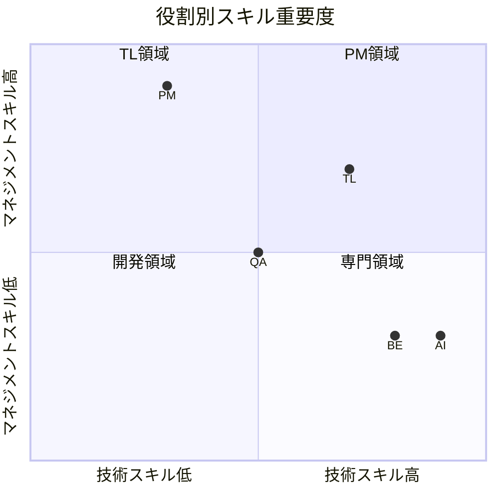

### 4.2 スキル要件詳細

| スキル | PM | TL | AI | BE | QA |
|--------|:--:|:--:|:--:|:--:|:--:|
| **プログラミング** |||||
| Python | △ | ◎ | ◎ | ◎ | ○ |
| TypeScript | △ | ◎ | ○ | ◎ | △ |
| **AI/ML** |||||
| LLM/GPT | △ | ◎ | ◎ | ○ | ○ |
| RAG | △ | ◎ | ◎ | ○ | △ |
| プロンプトエンジニアリング | △ | ○ | ◎ | △ | ○ |
| **インフラ** |||||
| クラウド（Azure/AWS） | △ | ○ | △ | ◎ | △ |
| Docker/コンテナ | △ | ○ | ○ | ◎ | △ |
| CI/CD | △ | ○ | △ | ◎ | ○ |
| **マネジメント** |||||
| プロジェクト管理 | ◎ | ○ | △ | △ | △ |
| リスク管理 | ◎ | ○ | △ | △ | ○ |
| ステークホルダー管理 | ◎ | ○ | △ | △ | △ |
| **品質管理** |||||
| テスト設計 | △ | ○ | ○ | ○ | ◎ |
| ドキュメントレビュー | ○ | ○ | △ | △ | ◎ |
| 品質分析 | ○ | ○ | ○ | △ | ◎ |

**凡例:** ◎必須/高度 ○必要/中程度 △あれば良い/基礎

---

## 5. 再委託に関する方針

### 5.1 再委託方針

本業務は**原則として再委託を行わない**方針とします。

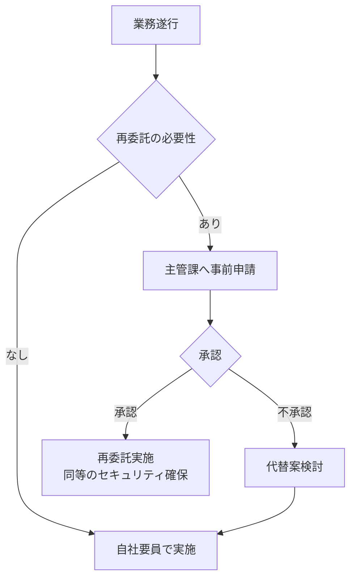

### 5.2 再委託が必要となる場合

万一、再委託が必要となる場合は以下の対応を行います：

1. **事前申請**: 書面にて主管課に申請・承認を得る
2. **セキュリティ確保**: 本契約と同等のセキュリティ管理を義務付け
3. **管理責任**: 再委託先の作業についても受注者が全責任を負う
4. **対象限定**: コア業務（AI開発、PoC実施）は再委託しない

---

## 6. 稼働計画

### 6.1 週別稼働計画

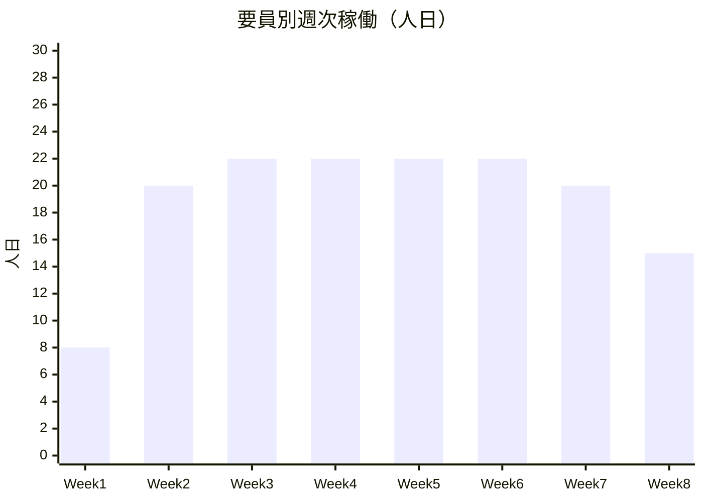

| 週 | PM | TL | AI | BE | QA | 合計 |
|----|:--:|:--:|:--:|:--:|:--:|:----:|
| Week 1 | 3 | 3 | 1 | 1 | 0 | 8 |
| Week 2 | 2 | 5 | 5 | 5 | 3 | 20 |
| Week 3 | 2 | 5 | 5 | 5 | 5 | 22 |
| Week 4 | 2 | 5 | 5 | 5 | 5 | 22 |
| Week 5 | 2 | 5 | 5 | 5 | 5 | 22 |
| Week 6 | 2 | 5 | 5 | 5 | 5 | 22 |
| Week 7 | 2 | 5 | 5 | 5 | 3 | 20 |
| Week 8 | 3 | 4 | 2 | 2 | 4 | 15 |
| **合計** | **18** | **37** | **33** | **33** | **30** | **151** |

### 6.2 総工数

| 役割 | 工数（人日） | 工数（人月） |
|------|-------------|-------------|
| PM | 18 | 0.9 |
| TL | 37 | 1.85 |
| AI | 33 | 1.65 |
| BE | 33 | 1.65 |
| QA | 30 | 1.5 |
| **合計** | **151** | **7.55** |

※1人月 = 20人日として算出

---

**以上**
