# 技術提案書

## 第三者検証業務におけるドキュメントレビュー支援AIエージェントの設計開発に係る調査研究

---

## 1. 技術アプローチ

### 1.1 全体アーキテクチャ

本提案では、Model Context Protocol (MCP) に準拠したマルチサーバーアーキテクチャを採用します。これにより、特定ベンダーに依存しない再現可能なPoCを実現します。

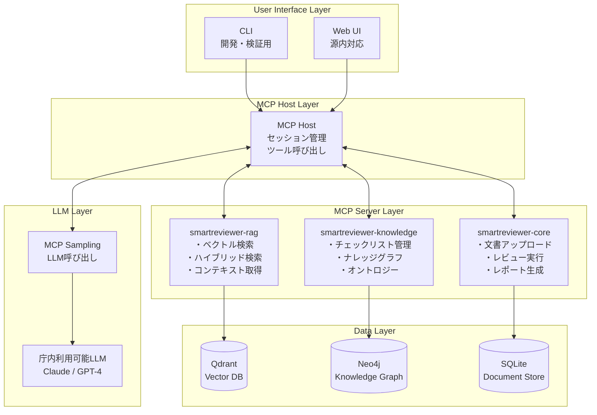

### 1.2 MCP準拠の利点

| 利点 | 説明 |
|------|------|
| **標準化** | JSON-RPC 2.0ベースの標準プロトコル |
| **拡張性** | 新しいサーバーやツールの追加が容易 |
| **再現性** | 異なる環境でも同一の動作を保証 |
| **ベンダー非依存** | 特定の技術・製品に依存しない |

---

## 2. 先行PoC課題への技術的対応

### 2.1 課題1: チェックリスト品質

#### 問題
- 既存のチェックリストは自然言語で記述されており、AIが正確に解釈しにくい
- チェック基準が曖昧な項目が存在

#### 解決策: 構造化チェックリスト

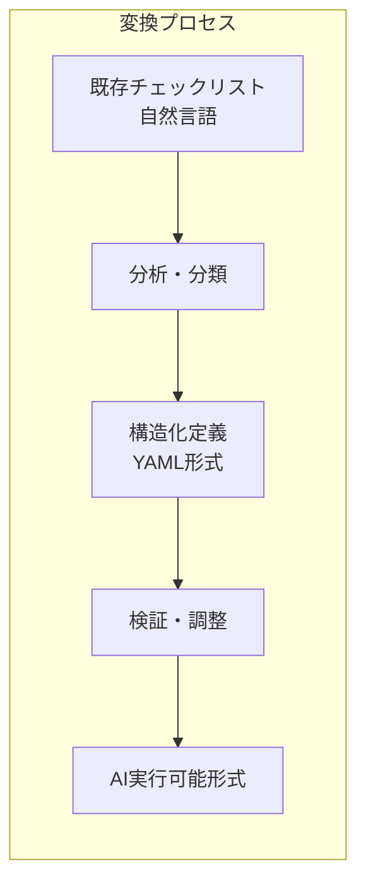

**構造化チェックリストの例:**

```yaml
check_items:
  - id: BD-001
    category: 基本設計書
    name: 必須セクション網羅性
    description: 基本設計書に必要なセクションが全て含まれているか
    required_sections:
      - システム概要
      - システム構成
      - 機能設計
      - データ設計
      - インターフェース設計
    check_logic: all_sections_present
    severity: high
    
  - id: BD-002
    category: 基本設計書
    name: システム目的の明確性
    description: システムの目的・背景が明確に記述されているか
    check_criteria:
      - keyword_present: ["目的", "背景", "概要"]
      - min_description_length: 200
      - clarity_score: >= 0.7
    check_logic: llm_evaluation
    severity: medium
```

### 2.2 課題2: 大容量文書処理

#### 問題
- 数万〜数十万文字の文書をLLMのコンテキスト長制限内で処理する必要がある
- 図表等のリッチコンテンツの取り扱い

#### 解決策: 階層的文書処理

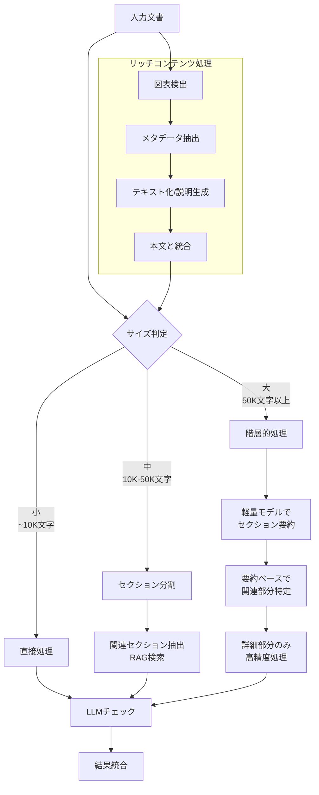

**処理戦略の詳細:**

| 文書サイズ | 処理方式 | 特徴 |
|-----------|---------|------|
| 小（~10K文字） | 直接処理 | 全文をLLMに投入 |
| 中（10K-50K文字） | セクション分割 | RAGで関連部分を抽出 |
| 大（50K文字以上） | 階層的処理 | 軽量モデルで要約→詳細処理 |

### 2.3 課題3: 是正提案の妥当性評価

#### 問題
- AIが生成する是正提案の品質を継続的に評価する仕組みがない
- 改善のためのフィードバックループが不在

#### 解決策: 回帰テスト環境

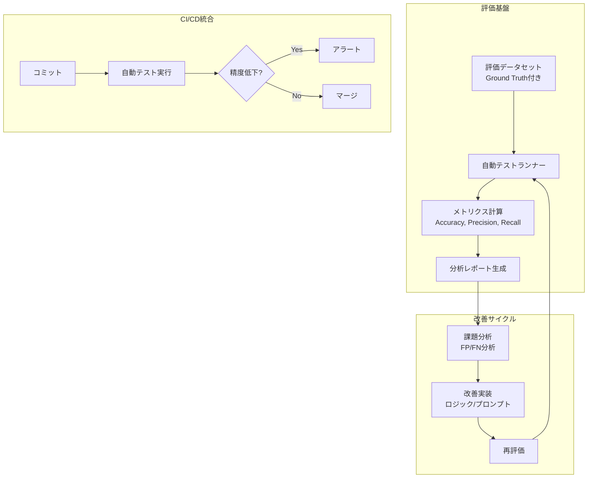

**評価フレームワーク:**

```python
# 評価システムの概念
class EvaluationRunner:
    def __init__(self, dataset: EvaluationDataset):
        self.dataset = dataset
    
    async def run_evaluation(self) -> EvaluationResult:
        results = []
        for test_case in self.dataset.test_cases:
            actual = await self.execute_check(test_case)
            expected = test_case.expected_result
            results.append(self.compare(actual, expected))
        
        return EvaluationResult(
            accuracy=self.calculate_accuracy(results),
            precision=self.calculate_precision(results),
            recall=self.calculate_recall(results),
            details=results
        )
```

### 2.4 課題4: 庁内AI環境への適合

#### 問題
- 源内における技術的制約（UI/UX、入出力形式、権限管理等）
- 監査要件への対応

#### 解決策: 制約考慮設計

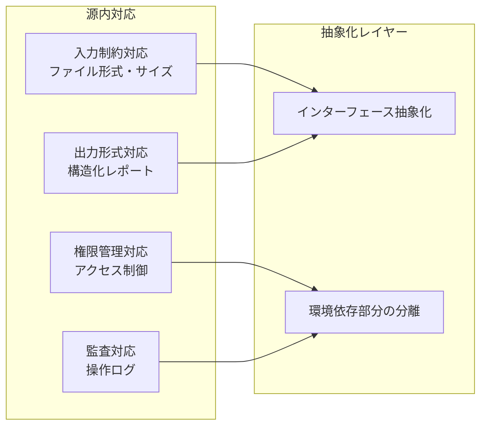

**庁内環境対応の設計方針:**

| 制約 | 対応方針 |
|------|---------|
| UI/UX制約 | 源内のUI規約に準拠したコンポーネント設計 |
| 入力形式 | 複数フォーマット対応（PDF, Word, Markdown） |
| 出力形式 | 構造化JSON + 人間可読レポート |
| 権限管理 | ロールベースアクセス制御（RBAC） |
| 監査ログ | 全操作の記録・保持 |

---

## 3. LLM/Embeddingモデル選定

### 3.1 選定基準

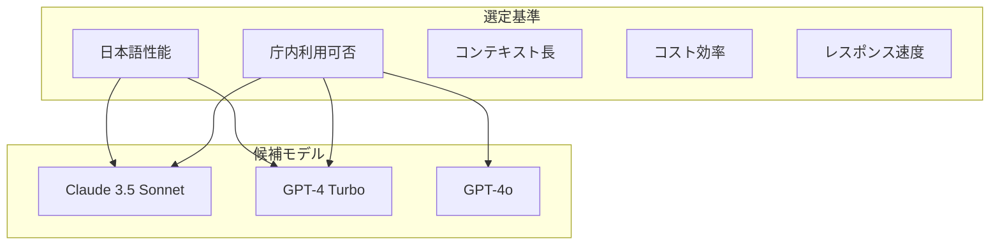

### 3.2 モデル比較（想定）

| モデル | 日本語性能 | コンテキスト | 速度 | コスト | 推奨用途 |
|--------|-----------|-------------|------|--------|---------|
| Claude 3.5 Sonnet | ◎ | 200K | ○ | 中 | メインチェック |
| GPT-4 Turbo | ○ | 128K | ○ | 高 | 複雑な判定 |
| GPT-4o | ○ | 128K | ◎ | 中 | 高速処理 |
| Claude 3 Haiku | ○ | 200K | ◎ | 低 | 軽量処理 |

### 3.3 ハイブリッド判定

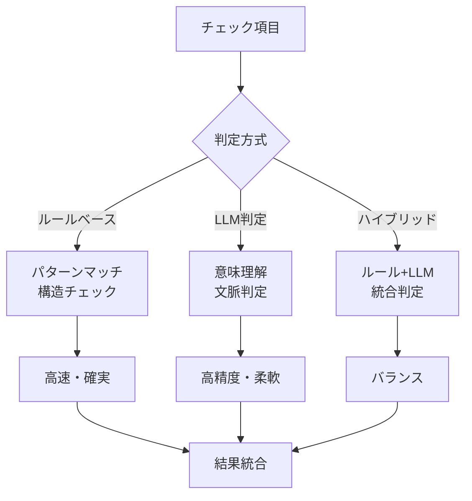

---

## 4. RAG実装

### 4.1 RAGアーキテクチャ

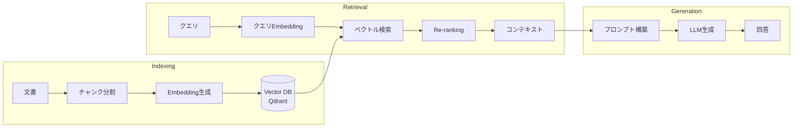

### 4.2 ハイブリッド検索

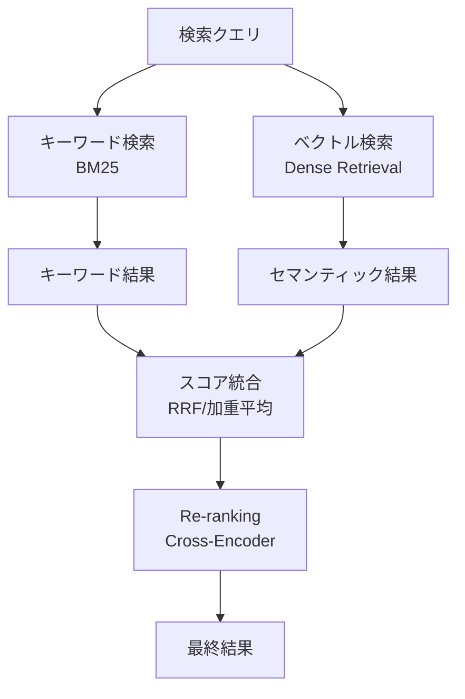

---

## 5. 評価指標と目標

### 5.1 KPI定義

| 指標 | 定義 | 目標値 |
|------|------|--------|
| **Accuracy** | (TP+TN)/(TP+TN+FP+FN) | ≥70% |
| **Precision** | TP/(TP+FP) | ≥70% |
| **Recall** | TP/(TP+FN) | ≥70% |
| **F1 Score** | 2×(Precision×Recall)/(Precision+Recall) | ≥70% |
| **処理時間** | 1文書あたりの処理時間 | ≤30秒 |
| **再現性** | 同一入力での結果一致率 | ≥95% |

### 5.2 評価データセット設計

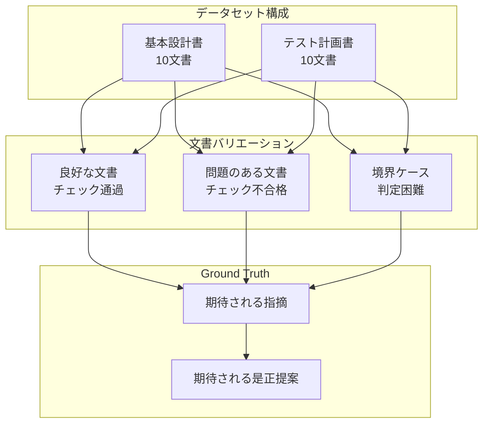

---

## 6. セキュリティ対策

### 6.1 データフロー

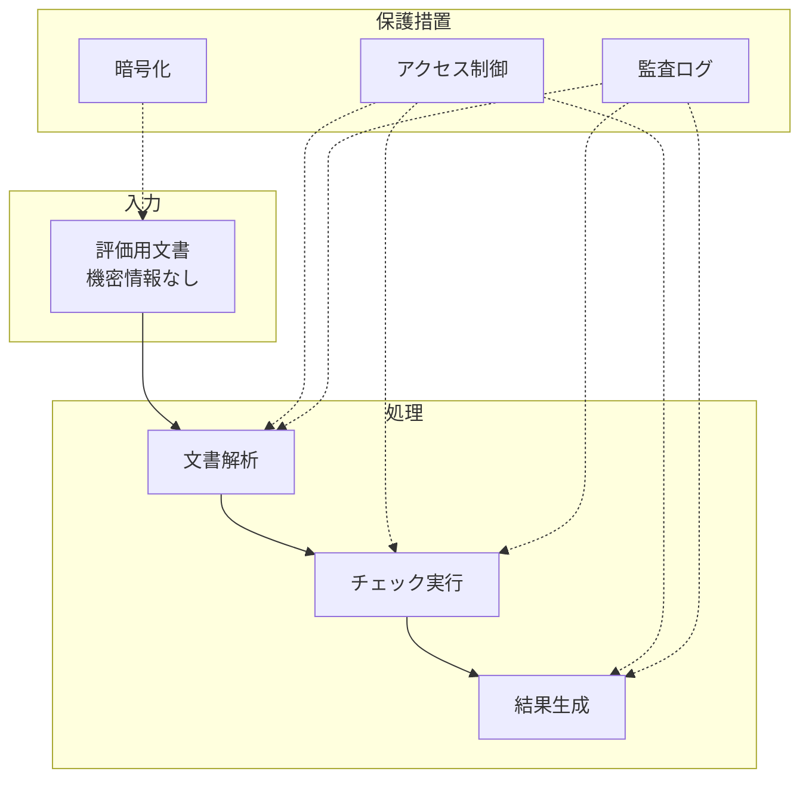

### 6.2 セキュリティ要件対応

| 要件 | 対応方針 |
|------|---------|
| 機密情報の取扱い | 機密情報を含まない評価データセットを使用 |
| データ漏洩防止 | AI学習に利用されないAPIオプションを使用 |
| アクセス制御 | ロールベースアクセス制御の実装 |
| 監査証跡 | 全操作のログ記録・保持 |

---

## 7. 技術スタック

| カテゴリ | 技術 | 選定理由 |
|---------|------|---------|
| 言語 | Python 3.12 | AIライブラリの充実、MCP SDK対応 |
| フレームワーク | FastMCP | MCP準拠サーバー実装 |
| CLI | Typer | モダンなCLI構築 |
| Vector DB | Qdrant | OSS、高性能、ISMAP対応可能 |
| Graph DB | Neo4j | ナレッジグラフ構築 |
| テスト | pytest | 標準的なテストフレームワーク |

---

**以上**
