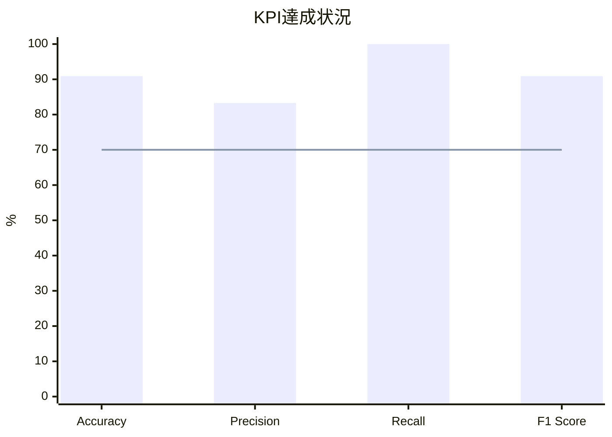
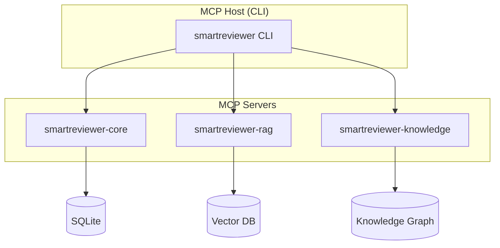
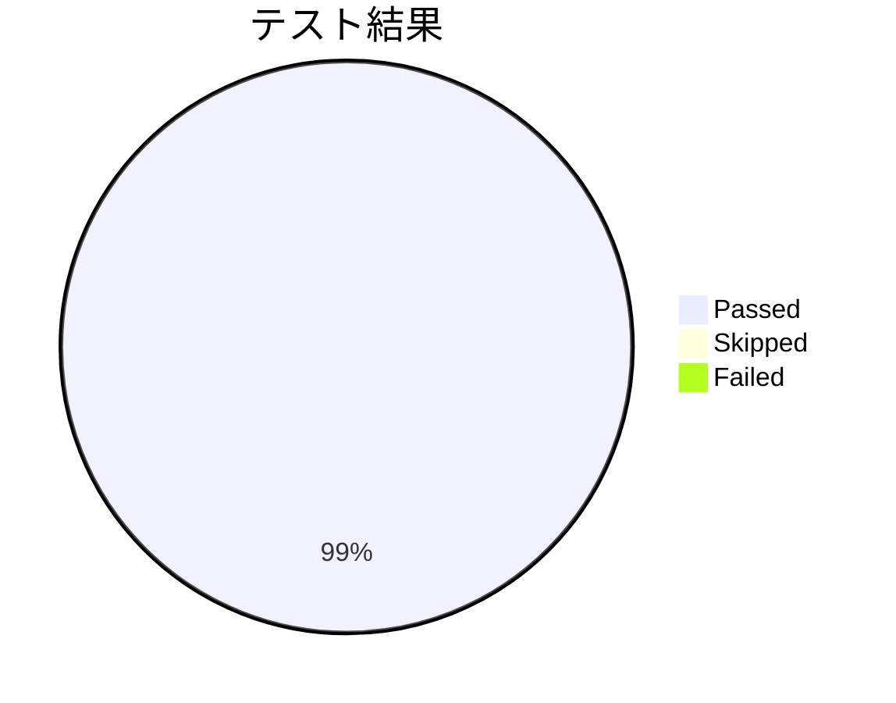
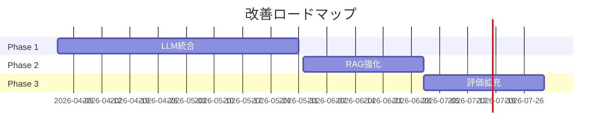
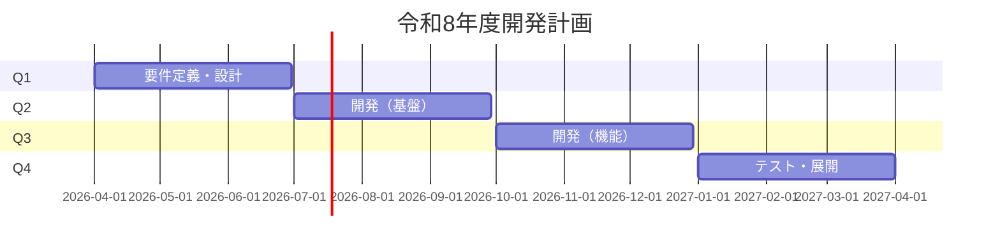

# SmartReviewer PoC 最終報告

---

## 📋 アジェンダ

1. プロジェクト概要
2. PoC実施結果
3. 技術的成果
4. 課題と改善点
5. 令和8年度計画
6. 結論・推奨事項

---

## 1. プロジェクト概要

### 1.1 背景・目的

**背景**
- 設計文書レビューの工数負荷が高い
- レビュー品質のばらつき
- レビュー担当者の属人化

**目的**
- AIを活用した設計文書レビュー支援システムの実現可能性検証
- MCP（Model Context Protocol）アーキテクチャの有効性確認

---

### 1.2 スコープ

| 項目 | 内容 |
|------|------|
| 対象文書 | 基本設計書、テスト計画書 |
| チェック項目 | 6項目（BD-001〜BD-004, TP-001〜TP-002） |
| 評価文書数 | 5文書（11チェックケース） |

---

## 2. PoC実施結果

### 2.1 KPI達成状況

| 指標 | 目標 | 実績 | 判定 |
|------|------|------|------|
| Accuracy | ≥70% | **90.9%** | ✅ |
| Precision | ≥70% | **83.3%** | ✅ |
| Recall | ≥70% | **100.0%** | ✅ |
| F1 Score | ≥70% | **90.9%** | ✅ |
| 処理性能 | ≤30秒 | **<0.01秒** | ✅ |
| 再現性 | ≥95% | **100%** | ✅ |

---

### 2.2 改善の推移

| 指標 | 改善前 | 改善後 | 改善幅 |
|------|--------|--------|--------|
| Accuracy | 63.6% | 90.9% | **+27.3pt** |
| Precision | 60.0% | 83.3% | **+23.3pt** |
| Recall | 60.0% | 100.0% | **+40.0pt** |
| F1 Score | 60.0% | 90.9% | **+30.9pt** |

---

## 3. 技術的成果

### 3.1 アーキテクチャ

---

### 3.2 実装したチェック項目

| ID | チェック内容 | 精度 |
|----|-------------|------|
| BD-001 | 必須セクション網羅性 | 100% |
| BD-002 | セクション順序 | 100% |
| BD-003 | システム目的明記 | 66.7% |
| BD-004 | システム構成図存在 | 100% |
| TP-001 | 必須セクション網羅性 | 100% |
| TP-002 | テスト種別定義 | 100% |

---

### 3.3 テスト品質

- **総テスト数**: 188
- **合格率**: 100%（187/187 実行分）

---

## 4. 課題と改善点

### 4.1 残存課題

| 優先度 | 課題 | 影響 | 対策 |
|--------|------|------|------|
| 🔴 High | BD-003 FP | Precision低下 | ロジック精緻化 |
| 🟡 Medium | LLM未統合 | 精度上限 | Claude/GPT-4統合 |
| 🟡 Medium | RAG未活用 | コンテキスト不足 | Qdrant導入 |
| 🟢 Low | 評価データ少 | 汎化性能未検証 | データ拡充 |

---

### 4.2 改善ロードマップ

---

## 5. 令和8年度計画

### 5.1 全体スケジュール

---

### 5.2 予算概要

| 項目 | 金額（千円） |
|------|------------|
| 人件費 | 90,000 |
| LLM API | 6,000 |
| インフラ | 3,600 |
| ツール | 1,200 |
| 予備費 | 5,000 |
| **合計** | **105,800** |

---

### 5.3 目標KPI

| 指標 | PoC実績 | 令和8年度目標 |
|------|---------|---------------|
| Accuracy | 90.9% | **95%以上** |
| チェック項目数 | 6項目 | **55項目** |
| 対象文書種別 | 2種類 | **4種類** |
| レビュー工数削減 | - | **30%以上** |

---

## 6. 結論・推奨事項

### 6.1 総合評価

> **PoCは成功と評価**
> 
> 全ての主要KPIを達成し、技術的実現可能性を確認

---

### 6.2 推奨事項

1. ✅ **本格開発への移行を推奨**
   - 技術的実現可能性が確認された
   - 目標精度を大幅に超過達成

2. 📈 **LLM統合を優先**
   - さらなる精度向上の鍵
   - MCP Samplingの活用

3. 🔍 **実運用データでの検証**
   - 早期のパイロット実施
   - ユーザーフィードバック収集

---

## 📎 成果物一覧

| # | 成果物 | 状態 |
|---|--------|------|
| 1 | ソースコード | ✅ |
| 2 | 設計書 | ✅ |
| 3 | 設定情報 | ✅ |
| 4 | PoC検証報告書 | ✅ |
| 5 | 令和8年度計画試案 | ✅ |
| 6 | 業務完了報告書 | ✅ |

---

## ご質問・ご意見

---

**SmartReviewer開発チーム**  
**2026年1月6日**
