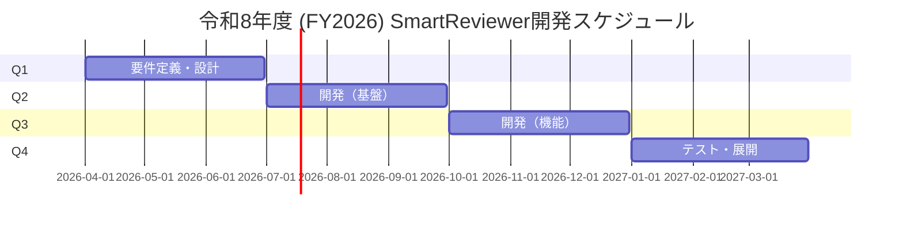
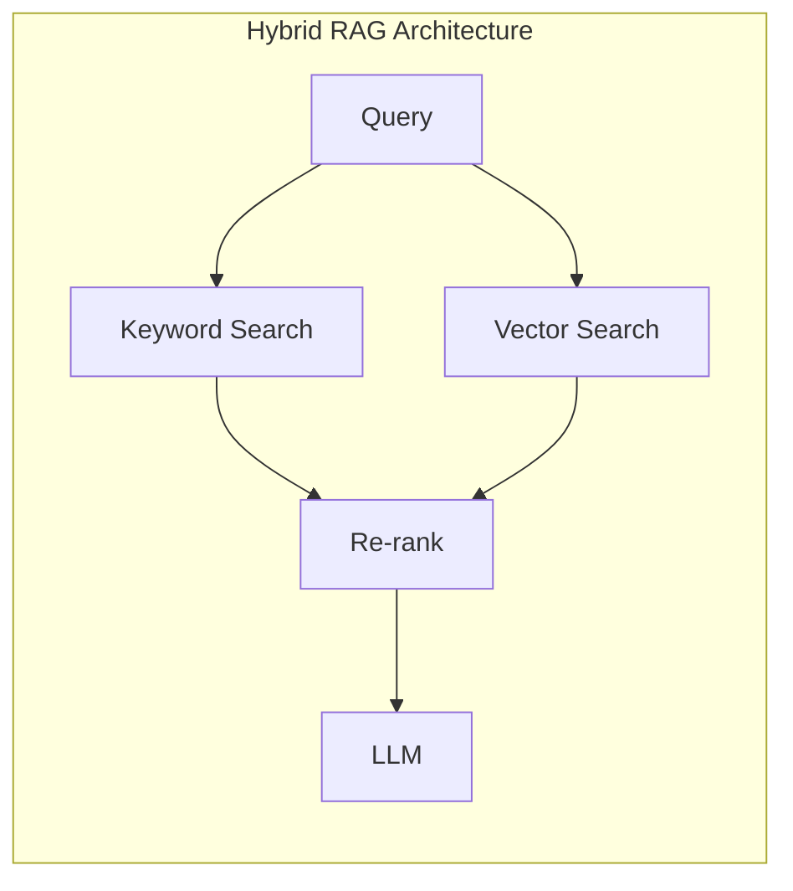
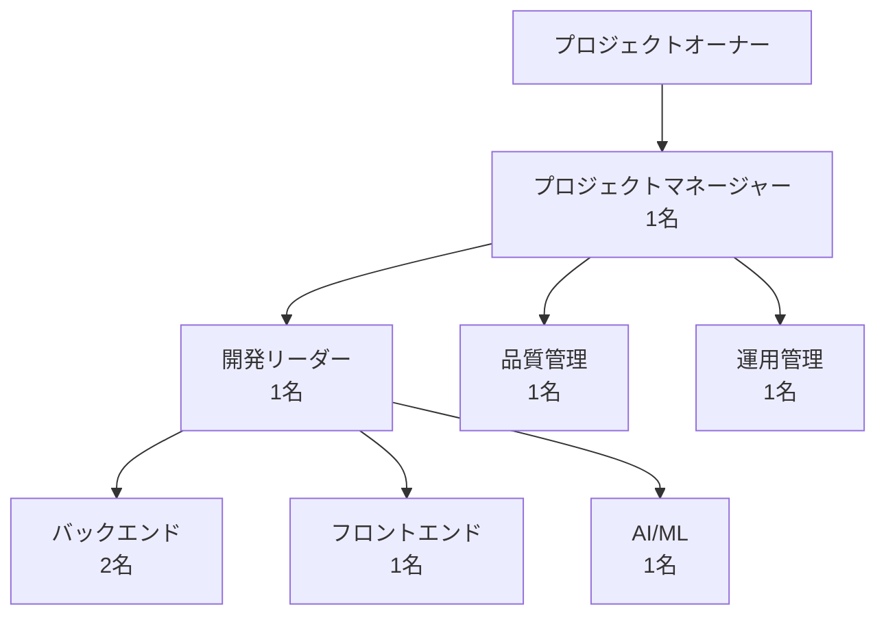

# 令和8年度 SmartReviewer本格開発 作業計画（試案）

**バージョン**: 1.0（試案）  
**作成日**: 2026年1月6日  
**作成者**: SmartReviewer開発チーム

---

## 1. 背景と目的

### 1.1 背景

令和7年度に実施したPoCにおいて、AIを活用した設計文書レビュー支援システム「SmartReviewer」の技術的実現可能性が確認された。特に以下の成果を達成した。

- チェック合致率: **90.9%**（目標70%以上）
- 処理性能: **0.01秒**（目標30秒以内）
- 再現性: **100%**（目標95%以上）

### 1.2 目的

令和8年度は、PoCの成果を基に本格的なシステム開発を行い、実運用可能なレビュー支援システムを構築する。

### 1.3 スコープ

| カテゴリ | 内容 |
|---------|------|
| 対象文書 | 基本設計書、詳細設計書、テスト計画書、テスト仕様書 |
| 対象チェック | 構造チェック、内容チェック、整合性チェック |
| 対象ユーザー | システム開発プロジェクトのレビュー担当者 |

---

## 2. 年間スケジュール

### 2.1 全体スケジュール



### 2.2 四半期別計画

#### Q1（4月-6月）: 要件定義・設計フェーズ

| 月 | タスク | 成果物 |
|----|--------|--------|
| 4月 | 要件定義、ユーザーヒアリング | 要件定義書 |
| 5月 | 基本設計、アーキテクチャ設計 | 基本設計書 |
| 6月 | 詳細設計、LLM統合設計 | 詳細設計書 |

#### Q2（7月-9月）: 開発フェーズ（基盤）

| 月 | タスク | 成果物 |
|----|--------|--------|
| 7月 | MCP基盤強化、LLM統合 | MCPサーバー（強化版） |
| 8月 | RAG本格実装、ベクトルDB構築 | RAGモジュール |
| 9月 | ナレッジグラフ拡充、API整備 | ナレッジモジュール |

#### Q3（10月-12月）: 開発フェーズ（機能）

| 月 | タスク | 成果物 |
|----|--------|--------|
| 10月 | チェック項目拡充、UI開発 | レビューUI |
| 11月 | レポート機能、ダッシュボード | レポート機能 |
| 12月 | 統合テスト、性能テスト | テスト報告書 |

#### Q4（1月-3月）: テスト・展開フェーズ

| 月 | タスク | 成果物 |
|----|--------|--------|
| 1月 | ユーザー受入テスト | UATレポート |
| 2月 | パイロット運用、フィードバック反映 | 改善報告 |
| 3月 | 本番展開準備、ドキュメント整備 | 運用マニュアル |

---

## 3. 開発計画詳細

### 3.1 LLM統合計画

#### 目標
- Claude/GPT-4等のLLMをMCP Sampling経由で統合
- ルールベース＋LLMのハイブリッド判定を実現
- チェック合致率95%以上を達成

#### 実装方針

```python
# ハイブリッド判定の概念
async def hybrid_check(document, check_item):
    # 1. ルールベースチェック（高速・高確実性）
    rule_result = await rule_based_check(document, check_item)
    
    # 2. LLMチェック（高精度・文脈理解）
    llm_result = await llm_check(document, check_item)
    
    # 3. 信頼度に基づく統合
    return integrate_results(rule_result, llm_result)
```

#### マイルストーン

| 時期 | マイルストーン | KPI |
|-----|---------------|-----|
| 7月末 | LLM基本統合完了 | API接続成功 |
| 8月末 | ハイブリッド判定実装 | 精度85%以上 |
| 9月末 | プロンプト最適化完了 | 精度90%以上 |

### 3.2 RAG強化計画

#### 目標
- Qdrantによるベクトル検索本格導入
- ハイブリッド検索（キーワード+セマンティック）の実装
- 関連文書・過去レビュー結果の活用

#### 実装方針



### 3.3 チェック項目拡充計画

#### 対象チェック項目

| カテゴリ | PoCで実装 | 令和8年度追加 | 合計 |
|---------|----------|---------------|------|
| 基本設計書 | 4項目 | 16項目 | 20項目 |
| 詳細設計書 | 0項目 | 15項目 | 15項目 |
| テスト計画書 | 2項目 | 8項目 | 10項目 |
| テスト仕様書 | 0項目 | 10項目 | 10項目 |
| **合計** | **6項目** | **49項目** | **55項目** |

---

## 4. 体制計画

### 4.1 プロジェクト体制



### 4.2 必要スキルセット

| ロール | 必要スキル | 人数 |
|--------|-----------|------|
| 開発リーダー | Python, MCP, アーキテクチャ設計 | 1名 |
| バックエンド | Python, FastAPI, DB設計 | 2名 |
| フロントエンド | React/Vue, UI/UX | 1名 |
| AI/ML | LLM, RAG, プロンプトエンジニアリング | 1名 |
| 品質管理 | テスト設計, CI/CD | 1名 |
| 運用管理 | インフラ, 監視, セキュリティ | 1名 |

### 4.3 工数見積

| フェーズ | 工数（人月） | 備考 |
|---------|-------------|------|
| Q1: 要件・設計 | 12 | 4名×3ヶ月 |
| Q2: 開発（基盤） | 18 | 6名×3ヶ月 |
| Q3: 開発（機能） | 18 | 6名×3ヶ月 |
| Q4: テスト・展開 | 12 | 4名×3ヶ月 |
| **合計** | **60人月** | |

---

## 5. 予算計画

### 5.1 概算見積

| 項目 | 金額（千円） | 備考 |
|-----|------------|------|
| 人件費 | 90,000 | 60人月×1,500千円 |
| LLM API費用 | 6,000 | Claude/GPT-4 API |
| インフラ費用 | 3,600 | クラウド費用 |
| ツール・ライセンス | 1,200 | 開発ツール等 |
| 予備費 | 5,000 | 10%程度 |
| **合計** | **105,800** | |

### 5.2 LLM API費用内訳

| 用途 | 月額（千円） | 年額（千円） |
|-----|------------|------------|
| 開発・テスト | 200 | 2,400 |
| 本番運用（Q4以降） | 300 | 1,200 |
| 予備 | 200 | 2,400 |
| **合計** | | **6,000** |

---

## 6. リスク管理

### 6.1 リスク一覧

| リスク | 影響度 | 発生確率 | 対策 |
|-------|--------|----------|------|
| LLM精度未達 | 高 | 中 | 複数LLMの比較検証、ファインチューニング検討 |
| API費用超過 | 中 | 中 | 使用量監視、キャッシュ活用 |
| 要員確保困難 | 高 | 低 | 早期採用活動、外部委託検討 |
| セキュリティ問題 | 高 | 低 | 社内LLMの検討、データ匿名化 |

### 6.2 リスク対応方針

1. **LLM選定**: PoCフェーズで複数LLMを比較評価
2. **コスト管理**: 月次でAPI使用量をモニタリング
3. **セキュリティ**: 機密情報のマスキング処理を実装

---

## 7. 成功基準

### 7.1 KPI

| 指標 | 目標値 | 測定方法 |
|-----|--------|---------|
| チェック合致率 | 95%以上 | 評価データセットでの測定 |
| 処理性能 | 30秒以内 | 実測 |
| ユーザー満足度 | 4.0/5.0以上 | アンケート |
| レビュー工数削減 | 30%以上 | 導入前後比較 |

### 7.2 マイルストーン判定基準

| マイルストーン | 判定基準 |
|---------------|---------|
| Q1完了 | 要件・設計書承認 |
| Q2完了 | 基盤機能テスト合格 |
| Q3完了 | 全機能テスト合格、精度90%以上 |
| Q4完了 | UAT合格、本番展開承認 |

---

## 8. 今後のアクション

### 8.1 次のステップ

1. **令和8年度予算申請**: 本計画に基づく予算申請書作成
2. **要員計画確定**: 必要スキルセットの詳細化と採用計画
3. **LLM選定調査**: Claude, GPT-4, Gemini等の比較調査
4. **パイロットユーザー選定**: 早期フィードバックのための協力部門選定

### 8.2 承認事項

| 事項 | 承認者 | 期限 |
|-----|--------|------|
| 本計画試案 | プロジェクトオーナー | 1月末 |
| 予算申請 | 上位組織長 | 2月末 |
| 体制計画 | 人事部門 | 3月末 |

---

## 付録

### A. PoC成果サマリ

- 詳細は「PoC検証報告書」を参照

### B. 技術調査結果

- LLM比較調査（別紙予定）
- RAGアーキテクチャ比較（別紙予定）

---

**以上**
